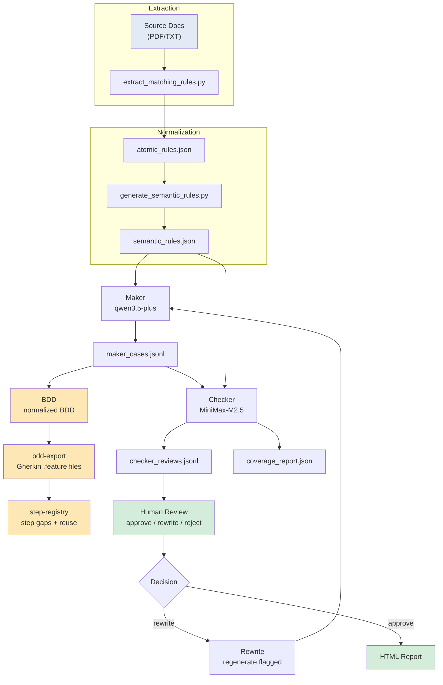

# LME Testing

`LME-Testing` is a document-driven AI test design prototype. It transforms LME official rule documents into structured testing artifacts through a governed pipeline, using dual AI models (maker/checker) to generate and evaluate BDD-style test scenarios.

## Project Status

### Verification Status

| Dimension | Status | Data |
|-----------|--------|------|
| Framework implementation | ✅ Complete | Code in `lme_testing/`, `schemas/`, `pipelines.py` |
| Schema contracts (7 schemas) | ✅ Complete | CI `schema-validation` job passes |
| POC E2E (2 rules) | ✅ Complete | `poc_two_rules` E2E verified |
| Full 183-rule quality baseline | 🔄 In Progress | Stage 1 S1-T04 |
| Checker real instability | 🔄 Unknown | Currently 0% from StubProvider; S1-T03b needed |
| Schema signal real data | 🔄 Missing | S1-T01 in progress |
| Governance signals coverage path | 🔄 Path mismatch | S1-T02 in progress |
| Real LME API execution | ⏳ Blocked | Stage 3, LME VM access needed |

### Verification Type Key

| Type | Meaning |
|------|---------|
| `code_implementation` | Code written, logically correct |
| `stub_verified` | StubProvider or POC (≤2 rules) verified |
| `real_data_verified` | Real LLM API + real-scale data verified |

> **Honest statement:** "All Phases Complete" claims from 2026-04-14 were based on code completion only. The v2.0 docs (2026-04-18) correct this — see `docs/roadmap.md` Section一 for full current-state table.

### Current Stage: Stage 1 — Real Data Access

See `docs/roadmap.md` for Stage 0/1/2/3 definition. Stage 1 tasks S1-T01 through S1-T05 are in `docs/implementation_plan.md`.

---

## System Flow



---

## Quick Start

### Step 1 — Run governance checks

Before modifying any code or artifacts, run governance checks to catch structural issues early:

```powershell
python scripts/check_docs_governance.py
python scripts/check_artifact_governance.py
python scripts/check_release_governance.py
```

| Script | What it checks | Expectation |
|--------|----------------|-------------|
| `check_docs_governance.py` | No absolute local paths in any `*.md` file link (e.g. `C:\path`, `/Users/name`, or `file:///C:/`). Links like `[Guide](docs/architecture.md)` (relative) are fine; absolute paths (starting with a drive letter) break when shared across machines or cloned in a different environment. | **Pass**: zero violations reported |
| `check_artifact_governance.py` | `atomic_rules.json` and `semantic_rules.json` have all required fields (`rule_id`, `semantic_rule_id`, `source`, `classification`, `evidence`); every `rule_type` value appears in the approved enum | **Pass**: zero violations reported |
| `check_release_governance.py` | Release artifacts (e.g. in `docs/releases/`) are complete and well-formed per the release governance contract | **Pass**: zero violations reported |

See [Governance Checks](#governance-checks) below for details.

### Step 2 — Generate test cases (start with POC sample, 2 rules)

```powershell
python main.py --config config/llm_profiles.example.json maker `
  --input artifacts/poc_two_rules/semantic_rules.json `
  --output-dir runs/maker `
  --batch-size 2
```

Find the run ID in the output, e.g. `runs/maker/20260414T143000+0800/` (local timezone).

### Step 3 — Assess quality and coverage

```powershell
python main.py --config config/llm_profiles.example.json checker `
  --rules artifacts/poc_two_rules/semantic_rules.json `
  --cases runs/maker/<run_id>/maker_cases.jsonl `
  --output-dir runs/checker
```

### Step 4 — Generate HTML report

```powershell
python main.py report `
  --maker-cases runs/maker/<run_id>/maker_cases.jsonl `
  --checker-reviews runs/checker/<run_id>/checker_reviews.jsonl `
  --maker-summary runs/maker/<run_id>/summary.json `
  --checker-summary runs/checker/<run_id>/summary.json `
  --coverage-report runs/checker/<run_id>/coverage_report.json `
  --output-html reports/<run_id>.html
```

Open `reports/<run_id>.html` in a browser.

### Step 5 — Human review (web UI)

> **Note:** `review-session` requires pre-existing maker and checker output files. It does **not** run the pipeline. To start from scratch and auto-launch the GUI when the pipeline finishes, use Step 6 instead.

```powershell
python main.py --config config/llm_profiles.example.json review-session `
  --rules artifacts/poc_two_rules/semantic_rules.json `
  --cases runs/maker/<run_id>/maker_cases.jsonl `
  --checker-reviews runs/checker/<run_id>/checker_reviews.jsonl `
  --output-dir runs/review_sessions
```

Open `http://127.0.0.1:8765` in a browser. Approve/rewrite/reject cases directly in the UI. It automatically reruns checker and regenerates reports.

### Step 6 — End-to-end workflow (pipeline + GUI auto-launch)

Runs the full pipeline from any start step, then **automatically launches the review-session web UI** when the checker completes:

```powershell
python main.py --config config/llm_profiles.example.json workflow-session --start-step maker
```

This is the recommended way to start the GUI from scratch — it runs maker → checker → then starts the web UI at `http://127.0.0.1:8765` automatically.

---

## CLI Commands

All commands: `python main.py <command> [options]`

| Command | Description |
|---------|-------------|
| `maker` | Generate BDD scenarios from semantic rules |
| `checker` | Assess scenario quality and compute rule coverage |
| `report` | Render JSON/JSONL outputs as HTML |
| `rewrite` | Regenerate cases flagged by human review |
| `planner` | Enrich rules with test objectives and scenario families |
| `bdd` | Convert scenarios to normalized BDD representation |
| `bdd-export` | Render normalized BDD into Gherkin `.feature` files |
| `step-registry` | Map BDD steps to step definition library, surface gaps |
| `human-review` | Generate a static HTML review page (no server needed) |
| `review-session` | **Web GUI** — interactive review at `http://127.0.0.1:8765` |
| `workflow-session` | Run E2E pipeline, auto-start `review-session` after checker |
| `governance-signals` | Compute operational metrics from run artifacts |

Show help for any command:

```powershell
python main.py maker --help
python main.py review-session --help
```

---

## Coverage Rule

Each `rule_type` maps to a set of `required_case_types`. A rule is **fully_covered** only when all required case types are accepted by checker:

| rule_type | Required | Optional |
|-----------|----------|----------|
| `obligation` | positive, negative | boundary, exception |
| `prohibition` | negative, positive | exception |
| `permission` | positive | — |
| `deadline` | positive, boundary, negative | — |
| `state_transition` | positive, state_transition | — |
| `data_constraint` | positive, negative, data_validation | — |

---

## Directory Overview

```
lme_testing/              # Core Python package
  cli.py                  # CLI entry, registers all 12 commands
  config.py               # Provider config loader
  providers.py            # OpenAI-compatible LLM adapter
  prompts.py              # Maker/Checker system prompts
  schemas.py              # JSON validation for all artifacts
  pipelines.py            # maker, checker, rewrite, planner, bdd pipelines
  storage.py              # JSON/JSONL read/write
  reporting.py            # HTML report generation
  review_session.py       # HTTP review web server
  workflow_session.py     # End-to-end orchestrator
  human_review.py         # Static HTML review page generator
  logging_utils.py        # Terminal + file logging
  bdd_export.py           # Gherkin .feature renderer
  step_registry.py       # Step-to-definition matching
  oracles/                # 8 deterministic assertion modules
    field_validation.py
    state_validation.py
    calculation_validation.py
    deadline_check.py
    event_sequence.py
    pass_fail_accounting.py
    null_check.py
    compliance_check.py
  signals/                # Governance signal computation

scripts/                  # Extraction and governance scripts
  extract_matching_rules.py      # PDF/TXT → atomic_rules.json
  generate_semantic_rules.py     # atomic_rules → semantic_rules
  validate_rules.py               # Schema/enum/duplicate validation
  check_docs_governance.py        # Enforce relative links in *.md
  check_artifact_governance.py    # Enforce artifact structure
  check_model_governance.py       # Enforce model metadata in runs
  check_release_governance.py     # Release file completeness
  check_release_governance.py     # Checker instability detection
  generate_trend_report.py         # Coverage drift comparison
  document_classes.py            # Multi-document ingestion
  setup_git_hooks.ps1            # Enable auto-refresh of session_handoff

schemas/                   # JSON Schema files
  atomic_rule.schema.json
  semantic_rule.schema.json
  maker_output.schema.json
  checker_output.schema.json
  planner_output.schema.json
  normalized_bdd.schema.json
  executable_scenario.schema.json
  fixtures/                 # Valid/invalid test fixtures

config/
  llm_profiles.example.json    # Provider config template
  approved_providers.json        # Tier-1/2/3 model分级
  compatibility_matrix.json     # Model × phase compatibility
  benchmark_thresholds.json     # Numeric governance gates
  human_review_options.json     # Review decision options

artifacts/
  lme_rules_v2_2/         # Full rule set (183 rules)
  poc_two_rules/           # Fast POC sample (2 rules)

tests/                    # 78 unit tests
docs/                     # Full documentation
runs/                     # Pipeline run outputs
reports/                  # HTML report outputs
```

---

## Extended Capabilities

### Deterministic Oracles

Eight oracle modules for structured rule categories:

```python
from lme_testing.oracles import evaluate_assertion

result = evaluate_assertion(
    {'assertion_id': 't1', 'type': 'null_check',
     'parameters': {'field': 'result', 'expected': 'non_null'}},
    {'input_data': {'result': 'ok'}}, None, {}
)
# result.status: pass | fail | unable_to_determine | error
```

### Governance Signals

Governance signals require real data to be meaningful. Current signal sources:

| Signal | Value | Data Source |
|--------|-------|-------------|
| `schema_failure_rate` | — | No persistent data (S1-T01 fix pending) |
| `checker_instability` | 0% | StubProvider (not real LLM) |
| `coverage_percent` | — | Full-run data not yet readable (S1-T02 fix pending) |
| `step_binding_rate` | 35.4% | Simulated step library, not real LME API |

Real numbers will be available after Stage 1 tasks complete.

### Release Governance

- `config/approved_providers.json` — Tier-1/2/3 model分级
- `config/compatibility_matrix.json` — Model × phase compatibility
- `config/benchmark_thresholds.json` — Numeric gates
- `docs/releases/RELEASES.md` — Version records

---

## BDD Pipeline

The system has a multi-stage BDD pipeline beyond the basic maker/checker loop:

```
semantic_rules → maker → bdd → bdd-export → step-registry
                         (normalized BDD)   (Gherkin)    (step gaps)
```

### Stage 1 — Maker (BDD scenarios)

```powershell
# Already in the basic loop; generates given/when/then scenarios
python main.py --config config/llm_profiles.example.json maker `
  --input artifacts/poc_two_rules/semantic_rules.json `
  --output-dir runs/maker --batch-size 4
```

### Stage 2 — Normalized BDD

Refines maker output into a structured normalized BDD artifact (`normalized_bdd.jsonl`):

```powershell
python main.py --config config/llm_profiles.example.json bdd `
  --cases runs/maker/<run_id>/maker_cases.jsonl `
  --output-dir runs/bdd --batch-size 4
```

Output: `runs/bdd/<run_id>/normalized_bdd.jsonl` — machine-readable BDD with step-level `given_steps`, `when_steps`, `then_steps`.

### Stage 3 — BDD Export

Renders normalized BDD into Gherkin `.feature` files (no LLM call — template-based):

```powershell
python main.py bdd-export `
  --cases runs/bdd/<run_id>/normalized_bdd.jsonl `
  --output-dir runs/bdd-export
```

Output: `runs/bdd-export/` with `*.feature` files and `step_definitions.py`.

### Stage 4 — Step Registry

Maps BDD steps to existing step definition library, surfaces reuse gaps and candidates:

```powershell
python main.py step-registry `
  --bdd-cases runs/bdd/<run_id>/normalized_bdd.jsonl `
  --step-defs path/to/step_definitions.rb `
  --output-dir runs/step-registry
```

Output: `runs/step-registry/step_visibility.json` — unmatched steps, exact/parameterized matches, candidate suggestions.

### Web GUI — What it shows

The review-session web UI (`http://127.0.0.1:8765`) has 4 stages:

- **Scenario Review** — approve/rewrite/reject each test case
- **BDD Review** — view normalized BDD scenarios, edit Given/When/Then steps inline
- **Scripts** — view step registry visibility with match quality badges (exact/parameterized/candidate/unmatched)
- **Finalize** — lock session and generate final HTML report

The HTML report includes:
- Clickable coverage metrics in "运行摘要" — clicking filters the "Rule 级覆盖判定" table
- Rule ID links jump to the corresponding sub-header in "场景审核明细" with highlighting
- Color-coded case-type pills (gray=Required, green=Present, blue=Accepted, red=Missing)
- Coverage Status + Rule Type dropdown filters with rule count

See `docs/architecture.md` for the full pipeline diagram and artifact contracts.

---

## Governance Checks

Run before and after substantial changes:

```powershell
python scripts/check_docs_governance.py
python scripts/check_artifact_governance.py
python scripts/check_release_governance.py
python -m unittest discover -v tests/
```

Enable auto-refresh of `session_handoff.md` on every commit:

```powershell
powershell -ExecutionPolicy Bypass -File scripts/setup_git_hooks.ps1
```

---

## Key Files for New Developers

Read in order:

1. `README.md` ← you are here
2. `docs/maker_checker_usage.md` — detailed CLI usage
3. `docs/architecture.md` — pipeline stages and module boundaries
4. `lme_testing/pipelines.py` — core pipeline logic
5. `lme_testing/schemas.py` — artifact contracts
