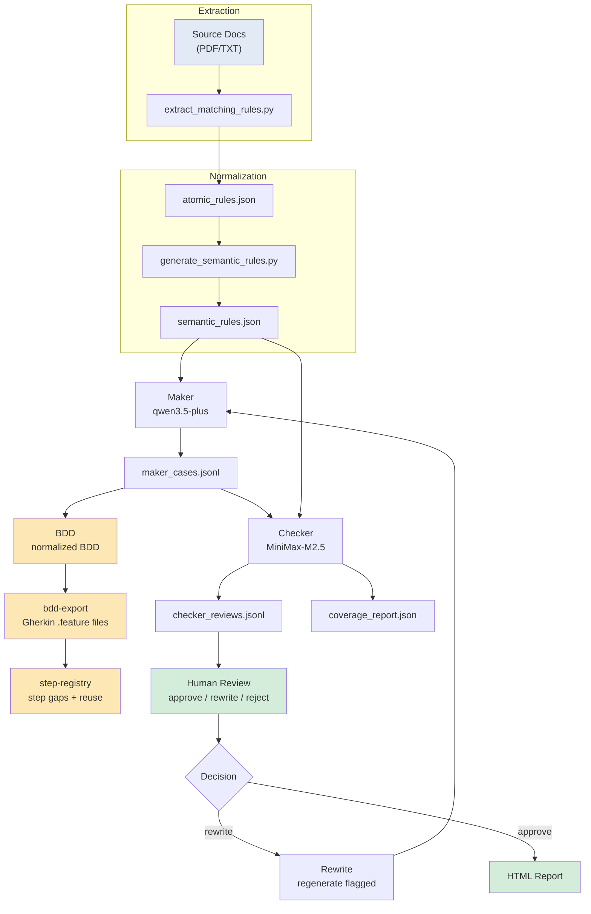

# LME Testing

`LME-Testing` is a document-driven AI test design prototype. It transforms LME official rule documents into structured testing artifacts through a governed pipeline, using dual AI models (maker/checker) to generate and evaluate BDD-style test scenarios.

## Project Status

### Verification Status

| Dimension | Status | Data |
|-----------|--------|------|
| Framework implementation | ✅ Complete | Code in `src/lme_testing/`, `schemas/`, `pipelines.py` |
| Schema contracts (7 schemas) | ✅ Complete | CI `schema-validation` job passes |
| POC E2E (2 rules) | ✅ Complete | `poc_two_rules` E2E verified |
| Full 183-rule quality baseline | ✅ Complete | 72.78% coverage (131/180), BASELINE-183-RULES.md |
| Checker real instability | ✅ Measured | 9.5% instability (exceeds 5% threshold) |
| Schema signal real data | ✅ Complete | `failure_rate = 0.0`, real_validation source |
| Governance signals coverage path | ✅ Complete | 23 runs scanned, 180 rules |
| Stage M (master merge) | ✅ Complete | SM-T01~SM-T05 all done, 2026-04-19 |
| Stage 2 prompt calibration | ✅ Complete | Maker/checker prompt v1.5/v1.3, 78.89% coverage |
| Mock API execution bridge | ✅ Complete | `deliverables/lme_mock_api.zip`, BDD/script HTTP validation |
| Initial Margin HKv13 mock bridge | ✅ Complete | `deliverables/im_hk_v13_mock_api/`, HTTP-backed BDD validation |
| Initial Margin HKv14 promoted bridge | ✅ Complete | HKv14 governed intake, diff mapping, three-term flat-rate validation |
| Mock API deliverables policy | ✅ Complete | Current Stage 2 bridge sources and zips remain under `deliverables/` |
| Review UI browser E2E | ✅ Complete | `tests/test_review_session_browser.py`, Chrome/Edge CDP harness |
| HKv14 role-friendly impact review | ✅ Stub | S2-F1 CLI generates canonical decision JSON, Markdown summary, and local review HTML |
| MVP document readiness registry | ✅ Stub | S2-F2 CLI generates canonical readiness JSON and derived Markdown summary |
| Rule extraction review GUI | ✅ Stub | S2-F4 `rule-workflow-session` document/rule review GUI, HKv14 smoke-reviewed |
| Pipeline batch concurrency | ✅ Stub | S2-F5 maker/checker ThreadPoolExecutor, deterministic output order, partial failure visibility |
| Real LME API execution | ⏳ Blocked | Stage 3, LME VM access needed |

### Verification Type Key

| Type | Meaning |
|------|---------|
| `code_implementation` | Code written, logically correct |
| `stub_verified` | StubProvider or POC (≤2 rules) verified |
| `real_data_verified` | Real LLM API + real-scale data verified |

### Current Stage: Stage 2 Complete → Stage 3 Blocked

**Stage M (master branch merge)** completed 2026-04-19: UTC timestamps, workflow interrupt handling, retry config, vendor archive all merged.

Stage 1 (real data access) is complete. Stage 2 scoped work is complete:
- **Maker/checker prompt v1.5/v1.3**: Coverage improved to 78.89% (142/180 fully covered)
- **S2-T01**: Complete; remaining gaps are evidence-constrained or LLM non-determinism
- **S2-B1/B2**: `audit_trail.py` and `case_compare.py` implemented and integrated
- **S2-C1**: Mock API execution bridge complete; BDD/script can call a deterministic HTTP API under test
- **S2-C2**: Initial Margin HKv13 mock API bridge complete; HKv13 remains the preservation baseline
- **S2-C3/S2-C4**: HKv14 governed intake, deterministic diff mapping, promoted downstream validation, and modular mock bridge complete
- **S2-C5**: Mock API deliverables policy complete; current bridge sources and zips stay under `deliverables/`
- **S2-D1**: Review UI browser-level E2E test covers the primary BDD/Scripts human path
- **S2-F1**: Role-friendly HKv14 impact decision review package generation complete; local HTML review surface plus canonical structured JSON
- **S2-F2**: MVP document readiness registry generation complete; Test Plan and Regression Pack Index remain explicit placeholders/blockers
- **S2-F4**: CodeFreddy rule extraction review GUI integrated on `main`; HKv14 PDF upload/extraction and scenario review smoke path validated with stub config
- **S2-F5**: Governed maker/checker batch concurrency implemented; deterministic JSONL ordering and partial failure visibility
- **S2-F7**: Rule workflow Scripts view and stage navigation follow-up plan recorded; implementation not started
- **Stage 3**: Still blocked pending real LME VM/API access

See `docs/planning/roadmap.md` and `TODO.md` for Stage 2 details.

---

## System Flow



---

## Quick Start

### Step 1 — Run governance checks

Before modifying any code or artifacts, run governance checks to catch structural issues early:

```powershell
python scripts/check_docs_governance.py
python scripts/check_artifact_governance.py
python scripts/check_release_governance.py
```

| Script | What it checks | Expectation |
|--------|----------------|-------------|
| `check_docs_governance.py` | No absolute local paths in any `*.md` file link (e.g. `C:\path`, `/Users/name`, or `file:///C:/`). Links like `[Guide](docs/architecture/architecture.md)` (relative) are fine; absolute paths (starting with a drive letter) break when shared across machines or cloned in a different environment. | **Pass**: zero violations reported |
| `check_artifact_governance.py` | `atomic_rules.json` and `semantic_rules.json` have all required fields (`rule_id`, `semantic_rule_id`, `source`, `classification`, `evidence`); every `rule_type` value appears in the approved enum | **Pass**: zero violations reported |
| `check_release_governance.py` | Release artifacts (e.g. in `docs/releases/`) are complete and well-formed per the release governance contract | **Pass**: zero violations reported |

See [Governance Checks](#governance-checks) below for details.

### Step 2 — Generate test cases (start with POC sample, 2 rules)

```powershell
python main.py --config config/llm_profiles.json maker `
  --input artifacts/poc_two_rules/semantic_rules.json `
  --output-dir runs/maker `
  --batch-size 2
```

Find the run ID in the output, e.g. `runs/maker/20260414T143000+0800/` (local timezone).

### Step 3 — Assess quality and coverage

```powershell
python main.py --config config/llm_profiles.json checker `
  --rules artifacts/poc_two_rules/semantic_rules.json `
  --cases runs/maker/<run_id>/maker_cases.jsonl `
  --output-dir runs/checker
```

### Step 4 — Generate HTML report

```powershell
python main.py report `
  --maker-cases runs/maker/<run_id>/maker_cases.jsonl `
  --checker-reviews runs/checker/<run_id>/checker_reviews.jsonl `
  --maker-summary runs/maker/<run_id>/summary.json `
  --checker-summary runs/checker/<run_id>/summary.json `
  --coverage-report runs/checker/<run_id>/coverage_report.json `
  --output-html reports/<run_id>.html
```

Open `reports/<run_id>.html` in a browser.

### Step 5 — Human review (web UI)

> **Note:** `review-session` requires pre-existing maker and checker output files. It does **not** run the pipeline. To start from scratch and auto-launch the GUI when the pipeline finishes, use Step 6 instead.

```powershell
python main.py --config config/llm_profiles.json review-session `
  --rules artifacts/poc_two_rules/semantic_rules.json `
  --cases runs/maker/<run_id>/maker_cases.jsonl `
  --checker-reviews runs/checker/<run_id>/checker_reviews.jsonl `
  --output-dir runs/review_sessions
```

Open `http://127.0.0.1:8765` in a browser. Approve/rewrite/reject cases directly in the UI. It automatically reruns checker and regenerates reports.

### Step 6 — End-to-end workflow (pipeline + GUI auto-launch)

Runs the full pipeline from any start step, then **automatically launches the review-session web UI** when the checker completes:

```powershell
python main.py --config config/llm_profiles.json workflow-session --start-step maker
```

This is the recommended way to start the GUI from scratch — it runs maker → checker → then starts the web UI at `http://127.0.0.1:8765` automatically.

### Step 7 — Rule extraction review GUI

Use this GUI to upload/import a source document or existing rule artifact folder, review atomic/semantic rules, save reviewed rule artifacts, and optionally generate scenario review output.

```powershell
python main.py rule-workflow-session --port 8765
```

If `config/llm_profiles.json` is absent, this command falls back to `config/llm_profiles.stub.json` so deterministic document/rule review can start without live LLM credentials. For the HKv14 POC, upload the PDF at `docs/materials/Initial Margin Calculation Guide HKv14.pdf` or import the existing artifact folder `artifacts/im_hk_v14/`. The PDF extractor uses `pypdf` first and falls back to `pdftotext` when available.

---

## CLI Commands

All commands: `python main.py <command> [options]`

| Command | Description |
|---------|-------------|
| `maker` | Generate BDD scenarios from semantic rules |
| `checker` | Assess scenario quality and compute rule coverage |
| `report` | Render JSON/JSONL outputs as HTML |
| `rewrite` | Regenerate cases flagged by human review |
| `planner` | Enrich rules with test objectives and scenario families |
| `bdd` | Convert scenarios to normalized BDD representation |
| `bdd-export` | Render normalized BDD into Gherkin `.feature` files |
| `step-registry` | Map BDD steps to step definition library, surface gaps |
| `human-review` | Generate a static HTML review page (no server needed) |
| `review-session` | **Web GUI** — interactive review at `http://127.0.0.1:8765` |
| `workflow-session` | Run E2E pipeline, auto-start `review-session` after checker |
| `rule-workflow-session` | **Web GUI** — document intake, rule extraction/review, history, optional scenario generation |
| `governance-signals` | Compute operational metrics from run artifacts |
| `im-hk-v14-role-review` | Generate the S2-F1 HKv14 role-friendly impact decision review package |
| `mvp-document-readiness` | Generate the S2-F2/S2-F3 MVP document readiness registry, optionally with real Test Plan and Regression Pack Index inputs |

Show help for any command:

```powershell
python main.py maker --help
python main.py review-session --help
```

---

## Coverage Rule

Each `rule_type` maps to a set of `required_case_types`. A rule is **fully_covered** only when all required case types are accepted by checker:

| rule_type | Required | Optional |
|-----------|----------|----------|
| `obligation` | positive, negative | boundary, exception |
| `prohibition` | negative, positive | exception |
| `permission` | positive | — |
| `deadline` | positive, boundary, negative | — |
| `state_transition` | positive, state_transition | — |
| `data_constraint` | positive, negative, data_validation | — |

---

## Directory Overview

```
src/
  lme_testing/            # LME matching-rule core package
    cli.py                # CLI entry, registers all 13 commands
    config.py             # Provider config loader
    providers.py          # OpenAI-compatible LLM adapter
    prompts.py            # Maker/Checker system prompts
    schemas.py            # JSON validation for all artifacts
    pipelines.py          # maker, checker, rewrite, planner, bdd pipelines
    storage.py            # JSON/JSONL read/write
    reporting.py          # HTML report generation
    review_session.py     # HTTP review web server
    rule_extraction.py    # Deterministic source-to-rule extraction for rule review GUI
    rule_workflow_session.py # Document/rule review GUI server
    im_hk_v14_role_review.py # HKv14 role review package generation
    mvp_document_readiness.py # MVP document readiness registry generation
    workflow_session.py   # End-to-end orchestrator
    human_review.py       # Static HTML review page generator
    logging_utils.py      # Terminal + file logging
    bdd_export.py         # Gherkin .feature renderer
    step_registry.py      # Step-to-definition matching
    oracles/              # 8 deterministic assertion modules
    signals/              # Governance signal computation
  hkex_testing/           # HKEX Initial Margin domain namespace
  rule_testing/           # Backward-compatible import alias

scripts/                  # Extraction and governance scripts
  extract_matching_rules.py      # PDF/TXT → atomic_rules.json
  generate_semantic_rules.py     # atomic_rules → semantic_rules
  validate_rules.py               # Schema/enum/duplicate validation
  check_docs_governance.py        # Enforce relative links in *.md
  check_artifact_governance.py    # Enforce artifact structure
  check_model_governance.py       # Enforce model metadata in runs
  check_release_governance.py     # Release file completeness
  check_release_governance.py     # Checker instability detection
  generate_trend_report.py         # Coverage drift comparison
  document_classes.py            # Multi-document ingestion
  setup_git_hooks.ps1            # Enable auto-refresh of session_handoff

schemas/                   # JSON Schema files
  atomic_rule.schema.json
  semantic_rule.schema.json
  maker_output.schema.json
  checker_output.schema.json
  planner_output.schema.json
  normalized_bdd.schema.json
  executable_scenario.schema.json
  fixtures/                 # Valid/invalid test fixtures

config/
  llm_profiles.json    # Provider config template
  approved_providers.json        # Tier-1/2/3 model分级
  compatibility_matrix.json     # Model × phase compatibility
  benchmark_thresholds.json     # Numeric governance gates
  human_review_options.json     # Review decision options

artifacts/
  lme_rules_v2_2/         # Full rule set (183 rules)
  poc_two_rules/           # Fast POC sample (2 rules)

tests/                    # 78 unit tests
docs/                     # Full documentation
evidence/                 # Preserved run artifacts (versioned)
runs/                     # Pipeline run outputs (gitignored)
```

---

## Extended Capabilities

### Mock API Execution Bridge

The repository includes standalone mock API packages for validating executable BDD scripts before real LME VM/API access is available.

Current policy: Stage 2 mock API bridge source folders and packaged zips remain under `deliverables/`. Revisit `docs/planning/mock_api_deliverables_policy.md` before adding a new mock bridge or promoting the bridges into maintained internal tools.

#### LME Matching Rules

```powershell
cd deliverables\lme_mock_api
python -m mock_lme_api.server --port 8766
```

In a second shell:

```powershell
cd deliverables\lme_mock_api
python run_bdd.py
```

Expected result: `33 passed, 0 failed`.

See `docs/planning/mock_api_validation_plan.md` and `deliverables/lme_mock_api/README.md`.

#### Initial Margin HKv13

```powershell
cd deliverables\im_hk_v13_mock_api
python run_bdd.py
```

Expected result: `37 passed, 0 failed`.

The HKv13 package is the preservation baseline for Initial Margin mock bridge work. See `docs/planning/im_hk_v13_mock_api_validation_plan.md`.

#### Initial Margin HKv14

```powershell
cd deliverables\im_hk_v14_mock_api
python poc_flat_rate_margin.py
python run_bdd.py
```

Expected result: flat-rate margin `15,180,000`; BDD summary `37 passed, 0 failed`.

HKv14 reuses `deliverables/im_hk_mock_api_common/` and validates the HKv14 three-term flat-rate example. See `docs/planning/im_hk_v14_promotion_scope.md`, `docs/planning/im_hk_v14_downstream_treatment_mapping.md`, and `docs/planning/im_hk_v14_mock_api_validation_plan.md`.

### Deterministic Oracles

Eight oracle modules for structured rule categories:

```python
from lme_testing.oracles import evaluate_assertion

result = evaluate_assertion(
    {'assertion_id': 't1', 'type': 'null_check',
     'parameters': {'field': 'result', 'expected': 'non_null'}},
    {'input_data': {'result': 'ok'}}, None, {}
)
# result.status: pass | fail | unable_to_determine | error
```

### Governance Signals

Governance signals are computed from run artifacts and updated on each run.

| Signal | Value | Data Source |
|--------|-------|-------------|
| `schema_failure_rate` | 0.0 | `evidence/schema_validation_latest.json` (370 fixtures) |
| `checker_instability` | 9.5% | `evidence/20260419_stability_v4/` (63 comparable cases) |
| `coverage_percent` | 72.78% | `evidence/20260419_baseline_full/` (180 rules) |
| `step_binding_rate` | 35.4% | Simulated step library, not real LME API (Stage 3) |

> **Note:** Latest coverage is determined by actual UTC wall-clock time (`_parse_timestamp()` in `signals/__init__.py`), not string sort. Benchmark runs with UTC (`Z`) timestamps sort correctly above local-offset (`+0800`) runs.

### Release Governance

- `config/approved_providers.json` — Tier-1/2/3 model分级
- `config/compatibility_matrix.json` — Model × phase compatibility
- `config/benchmark_thresholds.json` — Numeric gates
- `docs/releases/RELEASES.md` — Version records

---

## BDD Pipeline

The system has a multi-stage BDD pipeline beyond the basic maker/checker loop:

```
semantic_rules → maker → bdd → bdd-export → step-registry
                         (normalized BDD)   (Gherkin)    (step gaps)
```

### Stage 1 — Maker (BDD scenarios)

```powershell
# Already in the basic loop; generates given/when/then scenarios
python main.py --config config/llm_profiles.json maker `
  --input artifacts/poc_two_rules/semantic_rules.json `
  --output-dir runs/maker --batch-size 4
```

### Stage 2 — Normalized BDD

Refines maker output into a structured normalized BDD artifact (`normalized_bdd.jsonl`):

```powershell
python main.py --config config/llm_profiles.json bdd `
  --cases runs/maker/<run_id>/maker_cases.jsonl `
  --output-dir runs/bdd --batch-size 4
```

Output: `runs/bdd/<run_id>/normalized_bdd.jsonl` — machine-readable BDD with step-level `given_steps`, `when_steps`, `then_steps`.

### Stage 3 — BDD Export

Renders normalized BDD into Gherkin `.feature` files (no LLM call — template-based):

```powershell
python main.py bdd-export `
  --cases runs/bdd/<run_id>/normalized_bdd.jsonl `
  --output-dir runs/bdd-export
```

Output: `runs/bdd-export/` with `*.feature` files and `step_definitions.py`.

### Stage 4 — Step Registry

Maps BDD steps to existing step definition library, surfaces reuse gaps and candidates:

```powershell
python main.py step-registry `
  --bdd-cases runs/bdd/<run_id>/normalized_bdd.jsonl `
  --step-defs path/to/step_definitions.rb `
  --output-dir runs/step-registry
```

Output: `runs/step-registry/step_visibility.json` — unmatched steps, exact/parameterized matches, candidate suggestions.

### Web GUI — What it shows

The review-session web UI (`http://127.0.0.1:8765`) has 4 stages:

- **Scenario Review** — approve/rewrite/reject each test case
- **BDD Review** — view normalized BDD scenarios, edit Given/When/Then steps inline
- **Scripts** — view step registry visibility with match quality badges (exact/parameterized/candidate/unmatched)
- **Finalize** — lock session and generate final HTML report

The HTML report includes:
- Clickable coverage metrics in "运行摘要" — clicking filters the "Rule 级覆盖判定" table
- Rule ID links jump to the corresponding sub-header in "场景审核明细" with highlighting
- Color-coded case-type pills (gray=Required, green=Present, blue=Accepted, red=Missing)
- Coverage Status + Rule Type dropdown filters with rule count

See `docs/architecture/architecture.md` for the full pipeline diagram and artifact contracts.

---

## Governance Checks

Run before and after substantial changes:

```powershell
python scripts/check_docs_governance.py
python scripts/check_artifact_governance.py
python scripts/check_release_governance.py
python -m unittest discover -s tests -t . -v
```

Browser-level review UI E2E is included in unittest discovery when Chrome or Edge is installed. To run only that browser path:

```powershell
python -m unittest tests.test_review_session_browser -v
```

The browser test skips when no Chromium-family browser is available.

Enable auto-refresh of `session_handoff.md` on every commit:

```powershell
powershell -ExecutionPolicy Bypass -File scripts/setup_git_hooks.ps1
```

---

## Key Files for New Developers

Read in order:

1. `README.md` ← you are here
2. `docs/guides/maker_checker_usage.md` — detailed CLI usage
3. `docs/architecture/architecture.md` — pipeline stages and module boundaries
4. `src/lme_testing/pipelines.py` — core pipeline logic
5. `src/lme_testing/schemas.py` — artifact contracts
