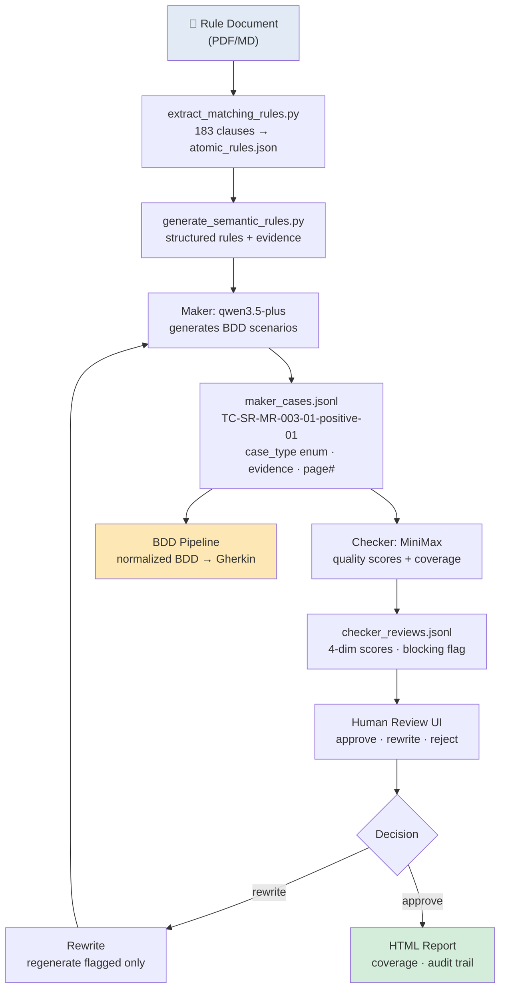
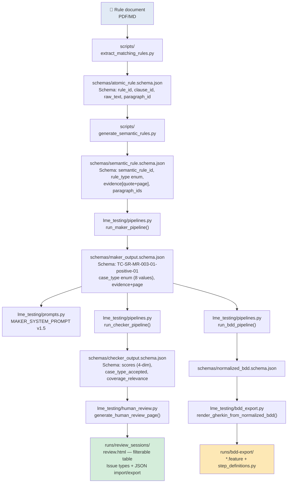

# LME-Testing — AI Test Generation Demo

**For:** Yu Zheng
**Date:** 2026/04/22
**Status:** Stage M complete · Stage 2 complete (S2-T01 at 78.89%, S2-B1/B2 integrated)

***

## What Problem Does This Solve?

Writing test cases from a dense financial rulebook is slow, error-prone, and inconsistent. LME-Testing automates that — reading the source document and producing structured, reviewable test scenarios in minutes instead of days.

***

## The Pipeline at a Glance



**183 rules → \~500 scenarios in \~3 hours** (full corpus, batch\_size=4)

***

## Enhancement vs. The Prototype

A prior prototype generated free-form scenario text with no schema, no scores, and no audit trail. Below is the exact same scenario end-to-end, showing every improvement — with the code that makes it real.

### Data Flow + Code Map



### The 10 Concrete Improvements

#### 1. Schema Contracts — Every Artifact is Validated

> Old: free-form JSON, any field could be missing or misspelled.
> New: `schemas/*.schema.json` enforces field names, types, and required values before any downstream stage runs.

**Code:** [`schemas/maker_output.schema.json`](../schemas/maker_output.schema.json), [`schemas/checker_output.schema.json`](../schemas/checker_output.schema.json), [`lme_testing/schemas.py`](../lme_testing/schemas.py) `validate_maker_payload()` / `validate_checker_payload()`

***

#### 2. Case ID Traceability — `TC-SR-MR-003-01-positive-01`

> Old: `SCENARIO-001` — opaque, no information.
> New: every ID encodes the rule + case type + sequence number.

```
TC-SR-MR-003-01-positive-01
 TC = Test Case
 SR-MR-003-01 = semantic rule ID
 positive = case type
 01 = sequence within this type
```

**Code:** [`lme_testing/pipelines.py`](../lme_testing/pipelines.py) `_maker_record_from_result()` — constructs `scenario_id` from rule + type + index.

***

#### 3. Case Type Enum — 8 Controlled Values

> Old: `happy_path`, `violation` — any string.
> New: `positive | negative | boundary | exception | state_transition | data_validation | deadline | enum_definition`

Enforces completeness: obligation rules require `positive + negative`; deadline rules require `positive + boundary + negative`.

**Code:** [`lme_testing/schemas.py`](../lme_testing/schemas.py) `CASE_TYPES` constant; [`lme_testing/prompts.py`](../lme_testing/prompts.py) `MAKER_SYSTEM_PROMPT` hard-requires enum values.

***

#### 4. Evidence with Page Numbers — Source Anchor

> Old: `MR-003: Price must be validated...` — no page ref, no paragraph ID.
> New: full quote + `page: 2` + `paragraph_ids: ["MR-003-01"]`.

Auditor can open the rulebook and find the exact line in seconds.

**Code:** [`scripts/extract_matching_rules.py`](../scripts/extract_matching_rules.py) extracts page/paragraph; [`lme_testing/pipelines.py`](../lme_testing/pipelines.py) propagates `paragraph_ids` through all pipeline stages.

***

#### 5. Checker 4-Dimensional Quality Scores

> Old: `overall_status: pass` — binary, no reasoning.
> New: four independent scores (1–5) plus blocking flag + coverage assessment.

```json
"scores": {
  "evidence_consistency": 5,    ← does scenario cite real rulebook text?
  "requirement_coverage": 5,    ← does scenario cover all required case types?
  "test_design_quality": 5,     ← is given/when/then well-structured?
  "non_hallucination": 5        ← did maker invent requirements not in evidence?
}
```

**Code:** [`lme_testing/prompts.py`](../lme_testing/prompts.py) `CHECKER_SYSTEM_PROMPT` defines 4-dim scoring; [`lme_testing/pipelines.py`](../lme_testing/pipelines.py) `run_checker_pipeline()` persists scores per review.

***

#### 6. BDD Pipeline — From Scenarios to Gherkin `.feature` Files

> Old: scenarios were the final output — not machine-executable.
> New: `bdd` pipeline converts maker cases → normalized BDD → Gherkin export → step definitions.

```
maker_cases.jsonl → bdd → normalized_bdd.jsonl → bdd-export → *.feature + step_definitions.py
```

**Code:** [`lme_testing/pipelines.py`](../lme_testing/pipelines.py) `run_bdd_pipeline()`; [`lme_testing/bdd_export.py`](../lme_testing/bdd_export.py) `render_gherkin_from_normalized_bdd()`.

***

#### 7. Human Review UI — Filterable, Taggable, Auditable

> Old: static table, no filters, no import/export.
> New: filter by overall/coverage/blocking; tag issue types; download/upload JSON for audit trail.

**Code:** [`lme_testing/human_review.py`](../lme_testing/human_review.py) `generate_human_review_page()`; [`lme_testing/review_session.py`](../lme_testing/review_session.py) live web server at `http://127.0.0.1:8765`.

## Step 1 — Semantic Rule (Input)

One rule from the LME Matching Rules document:

```json
{
  "semantic_rule_id": "SR-MR-003-01",
  "rule_type": "obligation",
  "statement": {
    "actor": "member",
    "action": "contact_exchange",
    "object": "trade"
  },
  "evidence": [{
    "quote": "Where an order or trade fails the price validation check,
              Members are required to contact the Exchange to explain
              the rationale as to the price of the rejected order or trade.",
    "page": 2
  }]
}
```

This is what the AI "understands" before generating tests.

***

## Step 2 — Maker Generates Test Cases (Output)

The **Maker** model (qwen3.5-plus) reads the rule and produces BDD scenarios:

```json
{
  "semantic_rule_id": "SR-MR-003-01",
  "feature": "Price Validation Failure Contact",
  "scenarios": [
    {
      "scenario_id": "TC-SR-MR-003-01-positive-01",
      "case_type": "positive",
      "given": ["An order or trade fails the price validation check"],
      "when":  ["The Member contacts the Exchange to explain the price rationale"],
      "then":  ["The obligation is considered fulfilled"],
      "evidence": [{"atomic_rule_id": "MR-003-01", "page": 2,
                    "quote": "Where an order or trade fails..."}]
    },
    {
      "scenario_id": "TC-SR-MR-003-01-negative-01",
      "case_type": "negative",
      "given": ["An order or trade fails the price validation check"],
      "when":  ["The Member does not contact the Exchange"],
      "then":  ["A compliance violation is recorded"],
      "evidence": [{"atomic_rule_id": "MR-003-01", "page": 2,
                    "quote": "Where an order or trade fails..."}]
    }
  ]
}
```

**For this one rule, Maker produced 2 scenarios (positive + negative) in \~60 seconds.**

***

## Step 3 — Checker Reviews Quality (Output)

The **Checker** model (MiniMax-M2.5) independently evaluates each scenario:

```json
{
  "case_id": "TC-SR-MR-003-01-positive-01",
  "case_type_accepted": true,
  "coverage_relevance": "direct",
  "is_blocking": false,
  "scores": {
    "evidence_consistency": 5,
    "requirement_coverage": 5,
    "test_design_quality": 5,
    "non_hallucination": 5
  },
  "coverage_assessment": {"status": "covered"}
}
```

Scores are 1–5. All 4 dimensions scored **5/5** here. No blocking findings.

Checker also produces a **Coverage Report** per rule type:

| rule\_type | required                     | present                      | missing | status             |
| ---------- | ---------------------------- | ---------------------------- | ------- | ------------------ |
| obligation | positive, negative           | positive, negative           | —       | **fully\_covered** |
| deadline   | positive, boundary, negative | positive, boundary, negative | —       | **fully\_covered** |

***

## Step 4 — BDD Export (Gherkin .feature file)

The normalized BDD can be exported directly to a Gherkin `.feature` file:

```gherkin
Feature: Price Validation Failure Contact
  SR-MR-003-01
  Verify obligation is fulfilled when trade fails price validation

  @positive @medium
  Scenario: Member contacts exchange after price validation failure
    Given An order or trade fails the price validation check
    When The Member contacts the Exchange to explain the price rationale
    Then The obligation is considered fulfilled

  @negative @medium
  Scenario: Member fails to contact exchange after price validation failure
    Given An order or trade fails the price validation check
    When The Member does not contact the Exchange
    Then A compliance violation is recorded
```

This is ready to drop into any Cucumber-compatible test runner.

***

## Step 5 — Web UI (Human Review)

The review session runs at `http://127.0.0.1:8765`:

- See all generated scenarios per rule
- Read checker scores and findings
- **Approve** → moves to final report
- **Rewrite** → AI regenerates only the flagged scenarios
- **Reject** → marks as out-of-scope

```
  Rule SR-MR-003-01
    Scenario TC-SR-MR-003-01-positive-01  ✅ Checker: 5/5/5  → Approve
    Scenario TC-SR-MR-003-01-negative-01  ⚠️ Checker: 4/5/4  → Rewrite
```

***

## What's new in current version

The April 1st action items assigned to the AI agent:

| # | Task                                         | Status                                                                                         |
| - | -------------------------------------------- | ---------------------------------------------------------------------------------------------- |
| 1 | Based on test cases, generate BDD            | ✅ Done — `bdd` pipeline produces `normalized_bdd.jsonl` + Gherkin export                       |
| 2 | Review & improve test case generation prompt | ✅ Done — Maker prompt v1.5 with hard requirements on evidence, case\_type enum, no duplication |

**Report UX (2026/04/18):**

| # | Feature | Detail |
| - | ------- | ------ |
| 1 | Clickable coverage metrics | Click Fully Covered / Partially Covered / Uncovered in "运行摘要" → filters "Rule 级覆盖判定" table |
| 2 | Rule ID jump | Click rule ID link → jumps to sub-header row in "场景审核明细" with highlight |
| 3 | Color-coded case-type pills | Inline chips: gray=Required, green=Present, blue=Accepted, red=Missing |
| 4 | Coverage + Rule Type filters | Dropdown filters on "Rule 级覆盖判定" with rule count and clear button |

### What "Great BDD Skill" Means

*Based on Test cases, generate BDD. Key is to come up with great BDD skill."*

Not generating text that looks like BDD, but engineering the prompt and schema so the AI consistently produces **machine-readable, executable BDD** with step patterns that can be matched to a step definition library.

Three layers make it "great":

***

#### Layer 1 — Prompt Engineering: `BDD_SYSTEM_PROMPT`

The prompt tells the AI to produce a **normalized intermediate artifact**, not raw Gherkin text:

```
You are the BDD normalization model...
You transform structured test cases into a normalized BDD representation
that is independent of final Gherkin syntax.
This normalized output is the governed intermediate artifact
consumed by Gherkin renderers and step-definition mappers.
```

Hard requirements in the prompt:

- Exactly one result per `semantic_rule_id`
- Preserve all traceability links (`semantic_rule_id`, `atomic_rule_ids`, `paragraph_ids`)
- Keep Given/When/Then steps **concise and declarative**
- `step_text` = natural-language step (e.g., "a member with valid LME session")
- `step_pattern` = regex-extracted pattern for step binding (copy `step_text` as-is for simple patterns)
- **Do not invent additional steps** beyond what is in the input
- Step definition code must use `LME::Client`, `LME::API`, `LME::PostTrade` patterns

**Code:** [`lme_testing/prompts.py`](../lme_testing/prompts.py) `BDD_SYSTEM_PROMPT` + [`lme_testing/pipelines.py`](../lme_testing/pipelines.py) `run_bdd_pipeline()`

***

#### Layer 2 — Normalized BDD Schema: `normalized_bdd.schema.json`

The output is governed by a schema that forces a specific structure:

```json
{
  "semantic_rule_id": "SR-MR-003-01",
  "feature_title": "Price Validation Failure Contact",
  "paragraph_ids": ["MR-003-01"],
  "scenarios": [{
    "scenario_id": "TC-SR-MR-003-01-positive-01",
    "case_type": "positive",
    "given_steps": [
      {
        "step_text": "an order or trade fails the price validation check",
        "step_pattern": "an order or trade fails the price validation check"
      }
    ],
    "when_steps": [...],
    "then_steps": [...]
  }]
}
```

The key fields: `step_text` (human-readable) + `step_pattern` (regex-ready for step definition matching).

**Code:** [`schemas/normalized_bdd.schema.json`](../schemas/normalized_bdd.schema.json) — enforces `step_text` + `step_pattern` per step; [`lme_testing/schemas.py`](../lme_testing/schemas.py) `validate_normalized_bdd_payload()`

***

## Full Run Stats (POC: 2 rules)

| Stage                  | Duration | Scenarios Generated     |
| ---------------------- | -------- | ----------------------- |
| Maker (qwen3.5-plus)   | \~2 min  | 5 scenarios             |
| Checker (MiniMax)      | \~1 min  | 5 reviews               |
| BDD export             | <1 sec   | 2 `.feature` files      |
| Step registry          | <1 sec   | 21 unique step patterns |

**183 rules** (full corpus) measured: Maker **\~45 min**, Checker **\~30 min** (batch\_size=8, real API). 78.89% coverage (142/180 rules fully covered).

***

## LLM Non-Determinism: Coverage Stability Across Runs

Same prompt, same model, same rules — but different results on different runs. This is LLM non-determinism. The table below shows what happened across 5 maker+checker runs on the same 180-rule corpus, with the same prompt versions.

### Prompt Version Timeline

| Version | Date | Key Change |
|---------|------|------------|
| v1.0 | 2026-04-20 | Baseline — no calibration guidelines |
| v1.1 | 2026-04-20 | Checker: workflow+exception, deadline+boundary, prohibition+positive → DIRECT |
| v1.3 | 2026-04-21 | Maker: prohibition positive + workflow exception guidance |
| v1.4 | 2026-04-21 | Checker v1.2: prohibition negative → DIRECT |
| v1.5 | 2026-04-21 | Checker v1.3: deadline positive/negative → DIRECT + regression guardrail |

### Coverage Across Runs

| Run | Date | Maker Ver | Checker Ver | Coverage | Fully Covered | Partially | Uncovered | Not Applicable |
|-----|------|-----------|-------------|----------|---------------|-----------|-----------|----------------|
| v1.0 | 04-20 | 1.2 | 1.1 | 72.22% | 130 | 17 | 2 | 34 |
| v1.1 | 04-20 | 1.2 | 1.1 | 75.00% | 135 | 12 | 1 | 35 |
| v1.3 | 04-21 | 1.3 | 1.1 | 74.44% | 134 | 13 | 1 | 35 |
| v1.4 | 04-21 | 1.4 | 1.2 | 77.22% | 139 | 8 | 1 | 35 |
| v1.5 | 04-21 | 1.5 | 1.3 | 78.89% | 142 | 5 | 1 | 35 |

### Non-Determinism: Same Rule, Different Outcomes Across Runs

Three rules fluctuated between fully covered and partially covered across runs:

| Rule | Rule Type | v1.0 | v1.1 | v1.3 | v1.4 | v1.5 | Pattern |
|------|-----------|-------|-------|-------|-------|-------|---------|
| SR-MR-070-02 | deadline | partial | partial | partial | partial | **full** | Only fixed after deadline+negative calibration in v1.5 |
| SR-MR-071-C-1 | workflow | partial | full | partial | partial | partial | Inconsistent — different case missing in each run |
| SR-MR-015-B3-4 | deadline | partial | partial | partial | partial | partial | Never fully covered — evidence lacks specific boundary value |

### Root Causes

**1. Checker calibration (fixable):** The checker guidelines evolved across versions. Adding `deadline+negative → DIRECT` in v1.5 was what fixed SR-MR-070-02 — it was a genuine calibration gap, not non-determinism.

**2. Evidence gaps (not fixable without new source docs):** SR-MR-015-B3-4 requires a specific boundary value in the evidence. The source text says "in exceptional circumstances" without defining what that means. No prompt version can fix this.

**3. LLM non-determinism (operational risk):** SR-MR-071-C-1 demonstrates that even well-calibrated prompts produce different judgments on borderline cases. The same scenario scored differently across runs. This is an inherent property of LLM inference — not a bug, but an operational risk.

### What This Means for Production

LLM non-determinism means **coverage is not monotonically improving with prompt upgrades**. A v1.5 run can regress on specific rules compared to v1.4. Strategies to manage this:

| Strategy | Description | Status |
|----------|-------------|--------|
| Prompt calibration | Fix coverage_relevance guidelines for each rule type | ✅ Done — v1.5 |
| Regression guardrail | Checker v1.3: don't lower evidence_consistency for edge cases | ✅ Done |
| Multi-run voting | Run same rules N times, accept majority outcome | Not implemented |
| Consolidated scenario design | Fix borderline scenarios manually after generation | Not implemented |
| Evidence enrichment | Re-extract source docs to fill gaps | Not implemented (no more source docs available) |

### Key Finding

**78.89% is the practical ceiling** for prompt-based calibration with the current evidence base. The remaining ~21% gap is split between:
- **Evidence-constrained** (~5 rules): source text lacks specificity (no boundary value, no exception clause, no prohibited action)
- **LLM non-determinism** (~3 rules): same prompt produces different judgments across runs

Further gains require either richer source documents or accepting coverage variance as an operational property of LLM-based test generation.

**Q: How does the AI know what to test?**
A: It reads the `evidence` field — a direct quote from the rulebook. Every scenario must cite which paragraph it came from. The AI cannot invent behavior not grounded in the text.

**Q: Who reviews the AI's work?**
A: A human reviewer uses the web UI to approve/rewrite/reject each scenario. The checker AI provides a quality score to help the human decide.

**Q: Can the AI make mistakes?**
A: Yes — that's why the Checker model independently reviews every scenario, and a human makes the final call. The Checker flags evidence inconsistencies, hallucinated requirements, and weak test design.

**Q: What happens if a scenario fails review (Rewrite)?**
A: Only the flagged scenarios are regenerated. Approved scenarios are preserved. This is the human-in-the-loop feedback loop.

**Q: What does the coverage report tell us?**
A: For each rule type, it shows which case types are present and which are missing. An obligation rule needs positive + negative at minimum. If either is missing, the status is `missing_case_types`.

**Q: How is this different from just using ChatGPT?**
A: Three differences: (1) Every output is schema-validated JSON — no free-form text; (2) Traceability to source paragraphs is mandatory — no hallucinated rules; (3) The checker AI independently critiques the maker AI's output before human review.

**Q: Can we integrate this with our existing test runner?**
A: Yes — the BDD export produces standard Gherkin `.feature` files compatible with Cucumber, Behave, or any Gherkin-capable framework. Step definitions can be auto-generated as Ruby/Python stubs.

**Q: What does "great BDD skill" mean — why was this hard?**
A: "BDD skill" is not about generating text that looks like BDD. It is about producing BDD that a machine can actually execute. Two things make it work: (1) The `BDD_SYSTEM_PROMPT` forces every step to have both a natural-language text AND a regex-extractable pattern. (2) The `normalized_bdd.schema.json` schema enforces traceability fields (`semantic_rule_id`, `paragraph_ids`) so every scenario can be traced back to the exact rulebook paragraph.

**Q: How does the Checker assign 1–5 scores? Is it a formula?**
A: No formula — the Checker model (MiniMax) **reads each scenario against the rule and judges it qualitatively**. The `CHECKER_SYSTEM_PROMPT` defines four dimensions:

| Dimension | What it measures |
|-----------|-----------------|
| `evidence_consistency` | Does the scenario cite real rulebook text? |
| `requirement_coverage` | Does the scenario cover all required case types for this rule? |
| `test_design_quality` | Is given/when/then well-structured and precise? |
| `non_hallucination` | Did the maker invent requirements not in the evidence? |

A score of **5** means "exceptional, no meaningful room for improvement." A **4** means "good, but with minor gaps." For example, a negative scenario getting 4/4 on coverage/design likely means it correctly maps to the rule but doesn't fully explore all boundary conditions or its given/when framing could be tighter.

Because scoring is judgmental (not formulaic), different models may score the same scenario differently. The `checker_instability_rate` tracks how often the checker disagrees with itself across runs — not a quality defect, but an operational metric showing whether prompt versioning or model swapping is causing erratic output.

