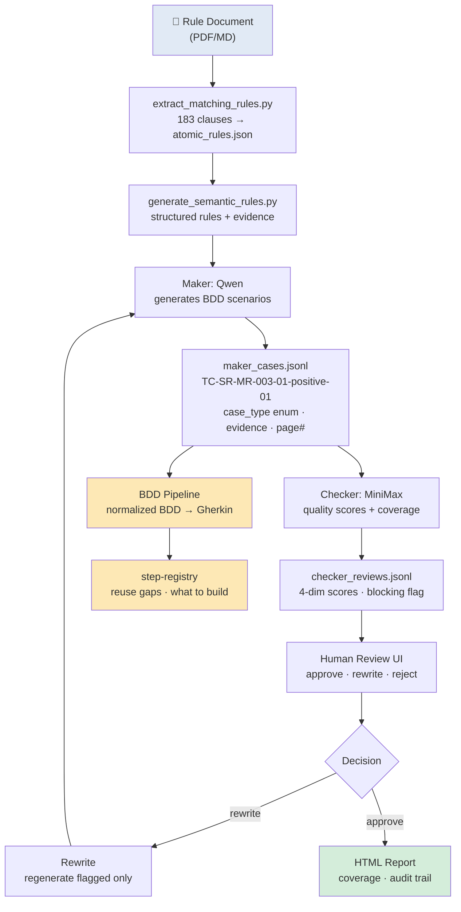
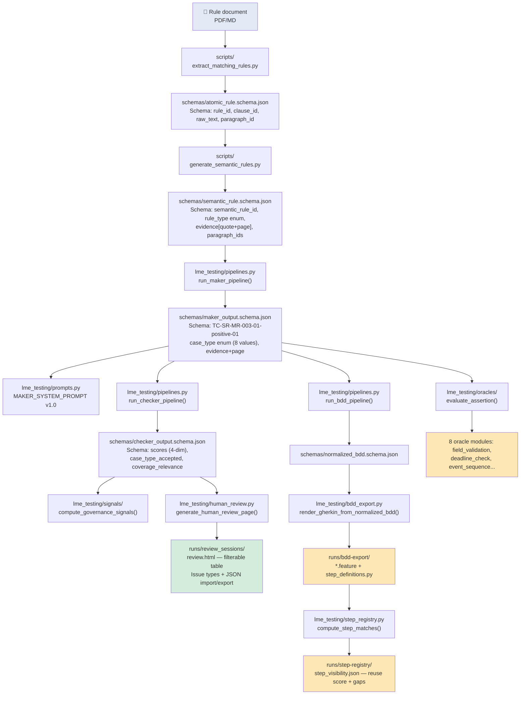
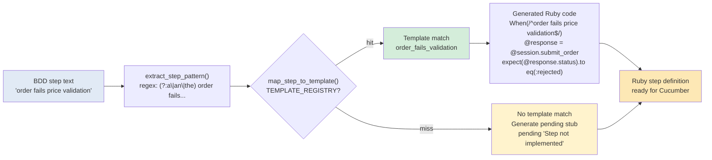
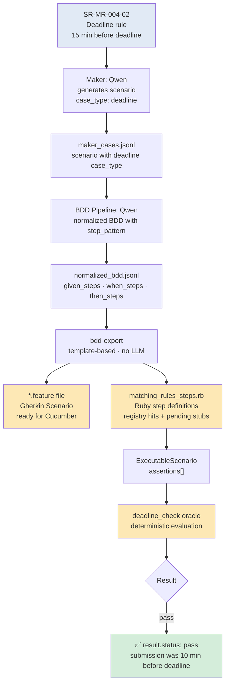

# LME-Testing — AI Test Generation Demo

**For:** Yu Zheng
**Date:** 2026/04/14
**Status:** All phases complete ✅

***

## What Problem Does This Solve?

Writing test cases from a dense financial rulebook is slow, error-prone, and inconsistent. LME-Testing automates that — reading the source document and producing structured, reviewable test scenarios in minutes instead of days.

***

## The Pipeline at a Glance



**183 rules → \~500 scenarios in \~3 hours** (full corpus, batch\_size=4)

***

## Enhancement vs. The Prototype

A prior prototype generated free-form scenario text with no schema, no scores, and no audit trail. Below is the exact same scenario end-to-end, showing every improvement — with the code that makes it real.

### Data Flow + Code Map



### The 10 Concrete Improvements

#### 1. Schema Contracts — Every Artifact is Validated

> Old: free-form JSON, any field could be missing or misspelled.
> New: `schemas/*.schema.json` enforces field names, types, and required values before any downstream stage runs.

**Code:** [`schemas/maker_output.schema.json`](../schemas/maker_output.schema.json), [`schemas/checker_output.schema.json`](../schemas/checker_output.schema.json), [`lme_testing/schemas.py`](../lme_testing/schemas.py) `validate_maker_payload()` / `validate_checker_payload()`

***

#### 2. Case ID Traceability — `TC-SR-MR-003-01-positive-01`

> Old: `SCENARIO-001` — opaque, no information.
> New: every ID encodes the rule + case type + sequence number.

```
TC-SR-MR-003-01-positive-01
 TC = Test Case
 SR-MR-003-01 = semantic rule ID
 positive = case type
 01 = sequence within this type
```

**Code:** [`lme_testing/pipelines.py`](../lme_testing/pipelines.py) `_maker_record_from_result()` — constructs `scenario_id` from rule + type + index.

***

#### 3. Case Type Enum — 8 Controlled Values

> Old: `happy_path`, `violation` — any string.
> New: `positive | negative | boundary | exception | state_transition | data_validation | deadline | enum_definition`

Enforces completeness: obligation rules require `positive + negative`; deadline rules require `positive + boundary + negative`.

**Code:** [`lme_testing/schemas.py`](../lme_testing/schemas.py) `CASE_TYPES` constant; [`lme_testing/prompts.py`](../lme_testing/prompts.py) `MAKER_SYSTEM_PROMPT` hard-requires enum values.

***

#### 4. Evidence with Page Numbers — Source Anchor

> Old: `MR-003: Price must be validated...` — no page ref, no paragraph ID.
> New: full quote + `page: 2` + `paragraph_ids: ["MR-003-01"]`.

Auditor can open the rulebook and find the exact line in seconds.

**Code:** [`scripts/extract_matching_rules.py`](../scripts/extract_matching_rules.py) extracts page/paragraph; [`lme_testing/pipelines.py`](../lme_testing/pipelines.py) propagates `paragraph_ids` through all pipeline stages.

***

#### 5. Checker 4-Dimensional Quality Scores

> Old: `overall_status: pass` — binary, no reasoning.
> New: four independent scores (1–5) plus blocking flag + coverage assessment.

```json
"scores": {
  "evidence_consistency": 5,    ← does scenario cite real rulebook text?
  "requirement_coverage": 5,    ← does scenario cover all required case types?
  "test_design_quality": 5,     ← is given/when/then well-structured?
  "non_hallucination": 5        ← did maker invent requirements not in evidence?
}
```

**Code:** [`lme_testing/prompts.py`](../lme_testing/prompts.py) `CHECKER_SYSTEM_PROMPT` defines 4-dim scoring; [`lme_testing/pipelines.py`](../lme_testing/pipelines.py) `run_checker_pipeline()` persists scores per review.

***

#### 6. BDD Pipeline — From Scenarios to Gherkin `.feature` Files

> Old: scenarios were the final output — not machine-executable.
> New: `bdd` pipeline converts maker cases → normalized BDD → Gherkin export → step definitions.

```
maker_cases.jsonl → bdd → normalized_bdd.jsonl → bdd-export → *.feature + step_definitions.py
```

**Code:** [`lme_testing/pipelines.py`](../lme_testing/pipelines.py) `run_bdd_pipeline()`; [`lme_testing/bdd_export.py`](../lme_testing/bdd_export.py) `render_gherkin_from_normalized_bdd()`.

***

#### 7. Step Registry — Know What to Build Next

> Old: not present.
> New: maps every generated step against an existing step definition library, reports exact/parameterized/candidate matches and unmatched gaps.

```
total_steps: 27
unmatched: 15   ← 15 steps need new step definitions built
exact_matches: 0
reuse_score: 35.4%
```

**Code:** [`lme_testing/step_registry.py`](../lme_testing/step_registry.py) `compute_step_matches()`, `extract_steps_from_normalized_bdd()`; [`lme_testing/cli.py`](../lme_testing/cli.py) `step-registry` CLI command.

***

#### 8. Human Review UI — Filterable, Taggable, Auditable

> Old: static table, no filters, no import/export.
> New: filter by overall/coverage/blocking; tag issue types; download/upload JSON for audit trail.

**Code:** [`lme_testing/human_review.py`](../lme_testing/human_review.py) `generate_human_review_page()`; [`lme_testing/review_session.py`](../lme_testing/review_session.py) live web server at `http://127.0.0.1:8765`.

***

#### 9. Governance Signals — Operational Metrics

> Old: none.
> New: automated metrics from run artifacts — `schema_failure_rate`, `checker_instability_rate`, `coverage_percent`, `step_binding_rate`.

```
schema_failure_rate:    0.0%
checker_instability:    0.0%
coverage_percent:     100.0%
step_binding_rate:    35.4%
```

**Code:** [`lme_testing/signals/compute_governance_signals()`](../lme_testing/signals/__init__.py); [`scripts/check_model_governance.py`](../scripts/check_model_governance.py); [`lme_testing/cli.py`](../lme_testing/cli.py) `governance-signals` CLI command.

***

#### 10. Deterministic Oracles — No LLM Needed to Judge Results

> Old: test pass/fail depended on human judgment.
> New: 8 deterministic assertion modules that evaluate rule-type-specific behavior without LLM.

```python
evaluate_assertion(
    {'assertion_id': 't1', 'type': 'null_check',
     'parameters': {'field': 'result', 'expected': 'non_null'}},
    {'input_data': {'result': 'ok'}}, None, {}
)
# result.status: pass | fail | unable_to_determine | error
```

**Code:** [`lme_testing/oracles/`](../lme_testing/oracles/__init__.py) — 8 modules: `field_validation`, `state_validation`, `calculation_validation`, `deadline_check`, `event_sequence`, `pass_fail_accounting`, `null_check`, `compliance_check`; [`lme_testing/oracles/__init__.py`](../lme_testing/oracles/__init__.py) `evaluate_assertion()` + `@register_oracle`.

***

## Step 1 — Semantic Rule (Input)

One rule from the LME Matching Rules document:

```json
{
  "semantic_rule_id": "SR-MR-003-01",
  "rule_type": "obligation",
  "statement": {
    "actor": "member",
    "action": "contact_exchange",
    "object": "trade"
  },
  "evidence": [{
    "quote": "Where an order or trade fails the price validation check,
              Members are required to contact the Exchange to explain
              the rationale as to the price of the rejected order or trade.",
    "page": 2
  }]
}
```

This is what the AI "understands" before generating tests.

***

## Step 2 — Maker Generates Test Cases (Output)

The **Maker** model (Qwen) reads the rule and produces BDD scenarios:

```json
{
  "semantic_rule_id": "SR-MR-003-01",
  "feature": "Price Validation Failure Contact",
  "scenarios": [
    {
      "scenario_id": "TC-SR-MR-003-01-positive-01",
      "case_type": "positive",
      "given": ["An order or trade fails the price validation check"],
      "when":  ["The Member contacts the Exchange to explain the price rationale"],
      "then":  ["The obligation is considered fulfilled"],
      "evidence": [{"atomic_rule_id": "MR-003-01", "page": 2,
                    "quote": "Where an order or trade fails..."}]
    },
    {
      "scenario_id": "TC-SR-MR-003-01-negative-01",
      "case_type": "negative",
      "given": ["An order or trade fails the price validation check"],
      "when":  ["The Member does not contact the Exchange"],
      "then":  ["A compliance violation is recorded"],
      "evidence": [{"atomic_rule_id": "MR-003-01", "page": 2,
                    "quote": "Where an order or trade fails..."}]
    }
  ]
}
```

**For this one rule, Maker produced 2 scenarios (positive + negative) in \~60 seconds.**

***

## Step 3 — Checker Reviews Quality (Output)

The **Checker** model (MiniMax) independently evaluates each scenario:

```json
{
  "case_id": "TC-SR-MR-003-01-positive-01",
  "case_type_accepted": true,
  "coverage_relevance": "direct",
  "is_blocking": false,
  "scores": {
    "evidence_consistency": 5,
    "requirement_coverage": 5,
    "test_design_quality": 5
  },
  "coverage_assessment": {"status": "covered"}
}
```

Scores are 1–5. All 3 dimensions scored **5/5** here. No blocking findings.

Checker also produces a **Coverage Report** per rule type:

| rule\_type | required                     | present                      | missing | status             |
| ---------- | ---------------------------- | ---------------------------- | ------- | ------------------ |
| obligation | positive, negative           | positive, negative           | —       | **fully\_covered** |
| deadline   | positive, boundary, negative | positive, boundary, negative | —       | **fully\_covered** |

***

## Step 4 — BDD Export (Gherkin .feature file)

The normalized BDD can be exported directly to a Gherkin `.feature` file:

```gherkin
Feature: Price Validation Failure Contact
  SR-MR-003-01
  Verify obligation is fulfilled when trade fails price validation

  @positive @medium
  Scenario: Member contacts exchange after price validation failure
    Given An order or trade fails the price validation check
    When The Member contacts the Exchange to explain the price rationale
    Then The obligation is considered fulfilled

  @negative @medium
  Scenario: Member fails to contact exchange after price validation failure
    Given An order or trade fails the price validation check
    When The Member does not contact the Exchange
    Then A compliance violation is recorded
```

This is ready to drop into any Cucumber-compatible test runner.

***

## Step 5 — Step Registry (Gap Analysis)

The system also maps generated steps against a **step definition library** to find reuse opportunities and gaps:

```json
{
  "total_steps": 27,
  "unique_bdd_patterns": 21,
  "exact_matches": 0,
  "parameterized_matches": 0,
  "candidates": 6,
  "unmatched": 15,
  "reuse_score": "35.4%"
}
```

**15 steps need new step definitions** — this tells the automation team exactly what to build next.

***

## Step 6 — Web UI (Human Review)

The review session runs at `http://127.0.0.1:8765`:

- See all generated scenarios per rule
- Read checker scores and findings
- **Approve** → moves to final report
- **Rewrite** → AI regenerates only the flagged scenarios
- **Reject** → marks as out-of-scope

```
  Rule SR-MR-003-01
    Scenario TC-SR-MR-003-01-positive-01  ✅ Checker: 5/5/5  → Approve
    Scenario TC-SR-MR-003-01-negative-01  ⚠️ Checker: 4/5/4  → Rewrite
```

***

## What's new in current version

The April 1st action items assigned to the AI agent:

| # | Task                                         | Status                                                                                         |
| - | -------------------------------------------- | ---------------------------------------------------------------------------------------------- |
| 1 | Based on test cases, generate BDD            | ✅ Done — `bdd` pipeline produces `normalized_bdd.jsonl` + Gherkin export                       |
| 2 | Review & improve test case generation prompt | ✅ Done — Maker prompt v1.0 with hard requirements on evidence, case\_type enum, no duplication |
| 3 | After BDD, generate Scripts                  | ✅ Done — Step definitions auto-generated from normalized BDD                                   |
| 4 | Show BDD in web portal with human edit       | ✅ Done — BDD tab with editable Given/When/Then; Scripts tab with match quality badges         |

**Report UX (2026/04/18):**

| # | Feature | Detail |
| - | ------- | ------ |
| 1 | Clickable coverage metrics | Click Fully Covered / Partially Covered / Uncovered in "运行摘要" → filters "Rule 级覆盖判定" table |
| 2 | Rule ID jump | Click rule ID link → jumps to sub-header row in "场景审核明细" with highlight |
| 3 | Color-coded case-type pills | Inline chips: gray=Required, green=Present, blue=Accepted, red=Missing |
| 4 | Coverage + Rule Type filters | Dropdown filters on "Rule 级覆盖判定" with rule count and clear button |

### What "Great BDD Skill" Means

*Based on Test cases, generate BDD. Key is to come up with great BDD skill."*

Not generating text that looks like BDD, but engineering the prompt and schema so the AI consistently produces **machine-readable, executable BDD** with step patterns that can be matched to a step definition library.

Three layers make it "great":

***

#### Layer 1 — Prompt Engineering: `BDD_SYSTEM_PROMPT`

The prompt tells the AI to produce a **normalized intermediate artifact**, not raw Gherkin text:

```
You are the BDD normalization model...
You transform structured test cases into a normalized BDD representation
that is independent of final Gherkin syntax.
This normalized output is the governed intermediate artifact
consumed by Gherkin renderers and step-definition mappers.
```

Hard requirements in the prompt:

- Exactly one result per `semantic_rule_id`
- Preserve all traceability links (`semantic_rule_id`, `atomic_rule_ids`, `paragraph_ids`)
- Keep Given/When/Then steps **concise and declarative**
- `step_text` = natural-language step (e.g., "a member with valid LME session")
- `step_pattern` = regex-extracted pattern for step binding (copy `step_text` as-is for simple patterns)
- **Do not invent additional steps** beyond what is in the input
- Step definition code must use `LME::Client`, `LME::API`, `LME::PostTrade` patterns

**Code:** [`lme_testing/prompts.py`](../lme_testing/prompts.py) `BDD_SYSTEM_PROMPT` v2.0 + [`lme_testing/pipelines.py`](../lme_testing/pipelines.py) `run_bdd_pipeline()`

***

#### Layer 2 — Normalized BDD Schema: `normalized_bdd.schema.json`

The output is governed by a schema that forces a specific structure:

```json
{
  "semantic_rule_id": "SR-MR-003-01",
  "feature_title": "Price Validation Failure Contact",
  "paragraph_ids": ["MR-003-01"],
  "scenarios": [{
    "scenario_id": "TC-SR-MR-003-01-positive-01",
    "case_type": "positive",
    "given_steps": [
      {
        "step_text": "an order or trade fails the price validation check",
        "step_pattern": "an order or trade fails the price validation check"
      }
    ],
    "when_steps": [...],
    "then_steps": [...]
  }]
}
```

The key fields: `step_text` (human-readable) + `step_pattern` (regex-ready for step definition matching). The step pattern is what lets the **step registry** match generated steps against an existing Ruby/Python step definition library.

**Code:** [`schemas/normalized_bdd.schema.json`](../schemas/normalized_bdd.schema.json) — enforces `step_text` + `step_pattern` per step; [`lme_testing/schemas.py`](../lme_testing/schemas.py) `validate_normalized_bdd_payload()`

***

#### Layer 3 — Template Registry: "Learning" from Good Step Definitions

The `bdd_export.py` includes a **template registry** of known LME step patterns with working Ruby/Python step definition code. This is the "BDD skill" — patterns learned from how the exchange actually works:

```python
TEMPLATE_REGISTRY = {
    "contact_exchange": {
        "given_pattern": "a member with valid LME session",
        "given_code": '''Given(/^a member with valid LME session$/) do
  @session = LME::Client.login
end'''
    },
    "order_fails_validation": {
        "when_pattern": "order fails price validation",
        "when_code": '''When(/^order fails price validation$/) do
  @order_params[:price] = '999999'
  @response = @session.submit_order(@order_params)
  expect(@response.status).to eq(:rejected)
end'''
    },
    "exchange_records_contact": {
        "then_pattern": "Exchange records the contact",
        "then_code": '''Then(/^Exchange records the contact$/) do
  expect(LME::PostTrade).to receive(:contact_exchange)
end'''
    }
}
```

When `bdd-export` renders Gherkin, it can **auto-generate step definition stubs** in Ruby/Python for any step that doesn't match the template registry — giving the automation team a head start on what to implement.

**Code:** [`lme_testing/bdd_export.py`](../lme_testing/bdd_export.py) `TEMPLATE_REGISTRY` + `render_steps_from_normalized_bdd()`

***

#### Why It Matters

A good BDD prompt without a schema produces inconsistent output. A schema without good prompts produces valid-but-nonsense output. The three layers together mean:

- The AI **cannot** skip required traceability fields
- Every step has a `step_pattern` that can be **matched against a step definition library**
- The automation team gets **working Ruby/Python step definition stubs** — they don't start from scratch
- Each `.feature` file is **drop-in compatible** with Cucumber, Behave, or any Gherkin runner

***

### What "After BDD, Generate Scripts" Means

*"After BDD stage, generate Scripts. This would be very challenging and interesting to investigate how to create meaningful code."*

There are **two distinct kinds** of script/code generation, both non-LLM and deterministic:

***

#### Script Layer 1 — Ruby/Python Step Definitions from BDD Steps

After the `bdd-export` stage, every BDD step has a `step_pattern`. The system generates Ruby/Python step definition code that binds each pattern to actual automation logic:



The `TEMPLATE_REGISTRY` is the "skill" — it encodes real LME trading patterns:

```python
TEMPLATE_REGISTRY = {
    "order_fails_validation": {
        "when_pattern": "order fails price validation",
        "when_code": '''When(/^order fails price validation$/) do
  @order_params[:price] = '999999'
  @response = @session.submit_order(@order_params)
  expect(@response.status).to eq(:rejected)
end'''
    },
    "contact_exchange": {
        "then_pattern": "member contacts Exchange",
        "then_code": '''Then(/^member contacts Exchange$/) do
  expect(LME::PostTrade).to receive(:contact_exchange)
  LME::PostTrade.contact_exchange(reason: @response.rejection_reason)
end'''
    }
}
```

The registry currently covers: session login, order submission, price validation failure, exchange contact, exchange records contact, deadline assertions, API GET/POST, and web/Selenium patterns.

**Code:** [`lme_testing/bdd_export.py`](../lme_testing/bdd_export.py) `render_steps_from_normalized_bdd()` + `TEMPLATE_REGISTRY`

For steps **not** in the registry, the system generates a **stub** with `pending`:

```ruby
Given(/^a member is logged in$/) do
  # TODO: Implement: A member is logged in
  pending "Step not implemented: a member is logged in"
end
```

These stubs are **not dead code** — they are a **roadmap**. Every `pending` step tells the automation team: "this step exists in our BDD, please implement it."

***

#### Script Layer 2 — Deterministic Oracles (Executable Assertions)

Assertions that run against actual test results, without any LLM:

Each `ExecutableScenario` can carry `assertions[]` — deterministic checks bound to rule types:

```json
{
  "assertion_id": "DLN-001-check",
  "type": "deadline_check",
  "parameters": {
    "submission_time": "result.submitted_at",
    "deadline": "2026-08-01T15:00:00Z",
    "operator": "before",
    "tolerance_minutes": 0
  }
}
```

The oracle evaluates it deterministically:

```python
result = evaluate_assertion(assertion, scenario, rule, context)
# result.status: pass | fail | unable_to_determine | error
```

8 oracle modules handle the 8 rule categories:

| Oracle                   | What it validates                                                   |
| ------------------------ | ------------------------------------------------------------------- |
| `field_validation`       | Field type, format, regex, enum, range, length                      |
| `state_validation`       | System state transitions (e.g., trade: pending → matched → settled) |
| `calculation_validation` | Arithmetic results, formula outputs                                 |
| `deadline_check`         | Submission before deadline, within window, tolerance                |
| `event_sequence`         | Events occurred in required order                                   |
| `pass_fail_accounting`   | Explicit pass/fail bookkeeping entries                              |
| `null_check`             | Field is null / non-null / equals a value                           |
| `compliance_check`       | Obligation fulfilled / prohibition not violated                     |

Example: a `deadline_check` oracle evaluates in pure Python — no LLM:

```python
# From lme_testing/oracles/deadline_check.py
def _check_deadline(submission_time, deadline, tolerance_minutes, operator):
    effective_deadline = deadline + timedelta(minutes=tolerance_minutes)
    if operator == "before":
        return submission_time <= effective_deadline
    if operator == "between":
        return window_start <= submission_time <= effective_deadline
```

**Code:** [`lme_testing/oracles/__init__.py`](../lme_testing/oracles/__init__.py) — each module registered via `@register_oracle`; [`lme_testing/oracles/__init__.py`](../lme_testing/oracles/__init__.py) `evaluate_assertion()` is the single entry point.

***

The gap between "BDD natural language step" and "working automation code" is large. Traditional BDD frameworks leave this gap entirely to humans — the automation engineer reads the `.feature` file and writes step definitions by hand.

This system bridges that gap in two ways:

1. **TEMPLATE\_REGISTRY**— encodes known LME patterns as working code. More patterns added = wider coverage.
2. **Stub generation + pending** — ensures no step is silently skipped. If the registry doesn't cover it, the step gets a `pending` stub, and the step registry reports it as an **unmatched** step that needs implementation.

The oracle framework goes further — it generates the **assertion code** that validates test outcomes, not just the step bindings. For deadline rules, this means the system can automatically judge whether a test passed or failed, without human interpretation.

***

#### End-to-End Example: From Rule to Executable Script



***

## Full Run Stats (POC: 2 rules)

| Stage             | Duration | Scenarios Generated     |
| ----------------- | -------- | ----------------------- |
| Maker (Qwen)      | \~2 min  | 5 scenarios             |
| Checker (MiniMax) | \~1 min  | 5 reviews               |
| BDD export        | <1 sec   | 2 `.feature` files      |
| Step registry     | <1 sec   | 21 unique step patterns |

**183 rules** (full corpus) estimated: Maker \~3 hrs, Checker \~2 hrs (with `batch_size=4` this drops significantly).

***

## Q\&A

**Q: How does the AI know what to test?**
A: It reads the `evidence` field — a direct quote from the rulebook. Every scenario must cite which paragraph it came from. The AI cannot invent behavior not grounded in the text.

**Q: Who reviews the AI's work?**
A: A human reviewer uses the web UI to approve/rewrite/reject each scenario. The checker AI provides a quality score to help the human decide.

**Q: Can the AI make mistakes?**
A: Yes — that's why the Checker model independently reviews every scenario, and a human makes the final call. The Checker flags evidence inconsistencies, hallucinated requirements, and weak test design.

**Q: What happens if a scenario fails review (Rewrite)?**
A: Only the flagged scenarios are regenerated. Approved scenarios are preserved. This is the human-in-the-loop feedback loop.

**Q: What does the coverage report tell us?**
A: For each rule type, it shows which case types are present and which are missing. An obligation rule needs positive + negative at minimum. If either is missing, the status is `missing_case_types`.

**Q: How is this different from just using ChatGPT?**
A: Three differences: (1) Every output is schema-validated JSON — no free-form text; (2) Traceability to source paragraphs is mandatory — no hallucinated rules; (3) The checker AI independently critiques the maker AI's output before human review.

**Q: Can we integrate this with our existing test runner?**
A: Yes — the BDD export produces standard Gherkin `.feature` files compatible with Cucumber, Behave, or any Gherkin-capable framework. Step definitions can be auto-generated as Ruby/Python stubs.

**Q: What does "great BDD skill" mean — why was this hard?**
A: "BDD skill" is not about generating text that looks like BDD. It is about producing BDD that a machine can actually execute. Three things make it work: (1) The `BDD_SYSTEM_PROMPT` forces every step to have both a natural-language text AND a regex-extractable pattern, so the step registry can match it. (2) The `normalized_bdd.schema.json` schema enforces traceability fields (`semantic_rule_id`, `paragraph_ids`) so every scenario can be traced back to the exact rulebook paragraph. (3) The `TEMPLATE_REGISTRY` in `bdd_export.py` pre-loads known LME step patterns (login, order submission, price validation, exchange contact) with working Ruby code — so the AI learns the "style" of good LME step definitions rather than inventing inconsistent ones. Without all three layers, you get valid JSON that cannot be executed or matched to a real step library.

**Q: Is BDD editing and Script viewing in the web portal? (Darcy's April 1 item)**
A: Darcy's item #4 asked: *"In the same Web portal, the process should progress to BDD and Script stage respectively, and display BDDs generated by AI, and allow Human to directly edit the BDD. After human modification, we should save it. Again, this will be used for Audit Trail."*

**✅ Done (2026/04/17):**

- **BDD tab**: Displays normalized BDD scenarios per approved case with editable Given/When/Then textarea fields. Save writes `human_bdd_edits_latest.json` in the session snapshot, wired into rewrite pipeline.
- **Scripts tab**: Displays step registry visibility with color-coded match quality badges (exact=green, parameterized=orange, candidate=blue, unmatched=red) and match counts.
- **Stage progress bar**: 4-stage progression (Scenario Review → BDD Edit → Scripts → Finalize) with gate logic enforcing tab unlock order.

**Code:** [`lme_testing/review_session.py`](../lme_testing/review_session.py) — BDD/Scripts tabs in `_render_review_session_shell()`, save routes + snapshot wiring; [`lme_testing/bdd_export.py`](../lme_testing/bdd_export.py) `apply_human_step_edits()` for edit application.

**Q: How does the Checker assign 1–5 scores? Is it a formula?**
A: No formula — the Checker model (MiniMax) **reads each scenario against the rule and judges it qualitatively**. The `CHECKER_SYSTEM_PROMPT` defines four dimensions:

| Dimension | What it measures |
|-----------|-----------------|
| `evidence_consistency` | Does the scenario cite real rulebook text? |
| `requirement_coverage` | Does the scenario cover all required case types for this rule? |
| `test_design_quality` | Is given/when/then well-structured and precise? |
| `non_hallucination` | Did the maker invent requirements not in the evidence? |

A score of **5** means "exceptional, no meaningful room for improvement." A **4** means "good, but with minor gaps." For example, a negative scenario getting 4/4 on coverage/design likely means it correctly maps to the rule but doesn't fully explore all boundary conditions or its given/when framing could be tighter.

Because scoring is judgmental (not formulaic), different models may score the same scenario differently. The `checker_instability_rate` governance signal tracks how often the checker disagrees with itself or with the maker — not a quality defect, but an operational metric showing whether prompt versioning or model swapping is causing erratic output.

