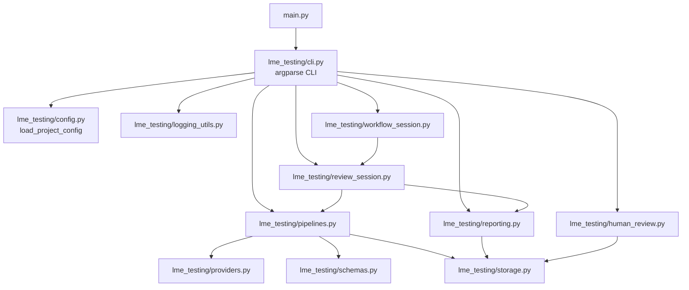

# LME-Testing 仓库深度研究报告

## 执行摘要

本仓库是一个“文档驱动测试设计（document-driven test design）”原型：把（与 entity["organization","London Metal Exchange","metal commodities exchange"] 相关的）撮合规则文档抽取为结构化规则（`atomic_rule` / `semantic_rule`），再用两个大模型角色（`maker` 生成 BDD 风格测试场景、`checker` 复核质量与覆盖）构建可追溯的测试设计流水线，并支持人工审核、按审核意见回写重生成，以及最终 HTML 报告输出。citeturn23view0

工程实现上，项目以 Python CLI 为入口（`main.py` → `lme_testing/cli.py`），核心逻辑集中在 `lme_testing/pipelines.py`（maker/checker/rewrite）、`lme_testing/review_session.py`（本地审核 Web 会话服务）与 `lme_testing/reporting.py`（HTML 报告生成）。citeturn22view0turn27view1turn38view1turn39view3turn42view1 其依赖声明为“仅使用 Python 标准库”，并建议最低 Python 3.11、曾在 Python 3.14.0 环境测过（该版本在多数环境中尚属非主流/前沿，实际复现更建议以 3.11–3.13 为主）。citeturn22view1

代码库成熟度偏早期：过去 12 个月（以 2026-04-07 为基准）仅 2 次提交（2026-03-22 初始提交、2026-03-30 增强 review-session/workflow/reporting 等），且未见 LICENSE 文件与 CI 工作流配置（例如 GitHub Actions）。citeturn9view0turn2view0turn26view1turn25view0 这会直接影响可复用性、合规性与持续质量保障。尤其仓库内包含一份 PDF 材料（`LME Matching Rules August 2022.pdf`），在缺少明确开源许可与第三方文档授权说明时，存在版权与再分发风险。citeturn26view1

测试方面，`tests/` 采用 `unittest`，通过 FakeProvider/patch 的方式避免真实网络调用，覆盖配置加载、三条 pipeline（maker/checker/rewrite）、ReviewSessionManager 的状态推进，以及 workflow-session 从已有产物启动并拉起本地 HTTP 服务等关键路径。citeturn45view0turn46view0turn48view0turn48view4 但也存在潜在“慢机/忙机”波动：review-session 测试用轮询 + `time.sleep(0.1)` 等待后台 job 结束，超时边界固定，可能导致偶发失败（flaky）。citeturn48view0

总体而言，仓库优点在于：端到端数据流清晰、输出产物（JSON/JSONL/HTML）结构化、对模型输出做了较严格的 JSON 解析与 schema 校验（含 Markdown code fence 清理）、并在本地文件服务中做了越权路径防护。citeturn44view0turn35view0turn39view3 主要改进方向集中在：补齐许可证与第三方材料合规说明、引入最小 CI、增强可安装/可发布的工程化配置、加强安全默认值（尤其 API key 管理）、扩大测试覆盖与降低时间相关 flaky 风险，以及为大规模规则集提供更可扩展的性能策略。citeturn25view0turn22view1turn48view0

## 代码库概览与演进

仓库在 entity["company","GitHub","code hosting platform"] 上以账号 entity["people","CodeFreddy","github user"] 发布，根目录包含：

- 核心包：`lme_testing/`
- 测试：`tests/`
- 抽取/生成脚本：`scripts/`
- 配置样例：`config/` 与 `.env.example`
- 文档与材料：`docs/`（含 PDF 与 Markdown 材料）
- 规则产物：`artifacts/`（含 `lme_rules_v2_2` 与 `poc_two_rules` 示例）
- CLI 入口：`main.py`
- 依赖声明：`requirements.txt`（当前为空依赖）citeturn2view0turn26view1turn22view1

提交历史在过去 12 个月仅两次：  
- 2026-03-22：初始提交（56 个文件变更，包含大量 artifacts 与 docs/materials）。citeturn9view0turn26view1  
- 2026-03-30：增强 review-session/workflow/reporting、补充/更新 config、tests 与多模块实现（19 个文件变更，+3025/-525）。citeturn9view0turn25view0  

在仓库展示的文件列表及初始提交的文件树中，未出现 `LICENSE`/`COPYING` 等许可声明文件，也未看到 `.github/workflows/`、`tox.ini`、`noxfile.py` 等 CI/自动化配置。citeturn2view0turn26view1 这意味着默认法律状态更接近“保留所有权利”，外部贡献与复用将面临高不确定性（尤其包含第三方 PDF 材料时风险更高）。citeturn26view1

## 运行环境与依赖

### Python 版本与依赖策略

`requirements.txt` 以注释形式明确“目前仅 Python 标准库，无第三方 pip 包”，并建议最低 Python 3.11。citeturn22view1 项目入口 `main.py` 仅调用 `lme_testing.cli.main()`，表明以“单仓库脚本/包”方式运行，而非打包发布的安装式 CLI。citeturn22view0

代码层面也印证了“零依赖”思路：例如 provider 调用使用 `urllib.request`/`http.client`；review-session 使用 `http.server.ThreadingHTTPServer`；测试使用 `unittest`/`unittest.mock.patch`。citeturn33view1turn39view3turn45view0turn46view0

### 模型调用与配置注入

项目通过 `lme_testing/config.py` 将 provider 配置抽象为 `ProviderConfig`（`base_url`、`api_key`、`model`、重试/超时、headers 等）并用 `ProjectConfig` 绑定角色（`maker`/`checker`）到具体 provider。citeturn30view0turn31view0 配置读取支持在 JSON 文件中使用 `${ENV_NAME}` 的环境变量模板替换，并支持两种 API key 写法：直接 `api_key`，或 `api_key_env`（既可以是环境变量名，也可能被当作“看起来像真实 key”的字符串直接使用，例如以 `sk-` 开头）。citeturn30view1turn30view2

这一设计提高了快速试验的便利性，但安全上有明显权衡：鼓励/容忍把 key 直接写进配置（尤其 `api_key_env` 兜底“sk-”逻辑），在团队协作与开源情境里更容易发生密钥误提交。citeturn30view2turn21view0

## 架构与数据流

### 端到端数据流

README 给出的典型流转为：

`source docs -> extract scripts -> atomic_rules.json -> semantic_rules.json -> maker -> checker -> review-session -> rewrite -> checker -> report`citeturn23view0

其中关键设计点是“严格覆盖判定”：规则不会因为“有一个 case 命中”就算覆盖；系统把每个 `rule_type` 映射到 `required_case_types`，只有当所有要求的 case_type 都被 checker 接受（并且满足 direct relevance、非 blocking 等条件）才视为 `fully_covered`。citeturn23view0turn37view2

下面的 Mermaid 图概括了主数据管道与产物（文件名为推断的典型输出，具体以各 pipeline summary 为准）：

```mermaid
flowchart LR
  A[规则源文档<br/>docs/materials] --> B[抽取脚本<br/>scripts/extract_matching_rules.py]
  B --> C[atomic_rules.json<br/>artifacts/...]
  C --> D[语义规则生成<br/>scripts/generate_semantic_rules.py]
  D --> E[semantic_rules.json]
  E --> F[maker pipeline<br/>pipelines.run_maker_pipeline]
  F --> G[maker_cases.jsonl]
  G --> H[checker pipeline<br/>pipelines.run_checker_pipeline]
  H --> I[checker_reviews.jsonl]
  H --> J[coverage_report.json]
  I --> K[人工审核 UI<br/>human_review / review_session]
  K --> L[human_reviews.json]
  L --> M[rewrite pipeline<br/>pipelines.run_rewrite_pipeline]
  M --> G2[merged_cases.jsonl]
  G2 --> H2[checker pipeline (rerun)]
  H2 --> I2[checker_reviews.jsonl (iteration)]
  H2 --> J2[coverage_report.json (iteration)]
  G2 --> R[reporting.generate_html_report]
  I2 --> R
  J2 --> R
  R --> Z[report.html + maker_readable.html + checker_readable.html]
```

### 模块分层与调用关系

`main.py` 作为单一入口，调用 `lme_testing/cli.py` 注册的各 CLI 子命令。citeturn22view0turn27view1 CLI 再分别驱动 pipelines/reporting/review-session/workflow-session：



在这个结构里，`schemas.py` 与 `storage.py` 更像“平台层”能力：前者负责模型输出与人工审核 payload 的 schema/合法性约束，后者负责 JSON/JSONL 与目录/时间戳等 IO 基础设施。citeturn44view0turn35view0

image_group{"layout":"carousel","aspect_ratio":"16:9","query":["LME-Testing pic1.png maker checker report screenshot"],"num_per_query":1}

（上图用于帮助理解仓库内 `screenshot/pic1.png` 所代表的“Maker/Checker/Report”可视化成果；实际页面由 `human_review.py`/`review_session.py`/`reporting.py` 生成。）citeturn20view0turn42view3turn39view3

## 核心模块逐文件解析

### 文件与模块对照表

下表聚焦“可执行逻辑与关键配置/测试文件”。“最后修改”按提交历史推断：2026-03-30 的增强提交明确列出的文件视为当日更新，其余以 2026-03-22 初始提交为最后修改日。citeturn25view0turn9view0turn26view1

| 路径 | 规模（行数/大小） | 最后修改 | 作用概述 |
|---|---:|---:|---|
| `main.py` | 5 行（3 loc）· 91 B citeturn22view0 | 2026-03-22 citeturn9view0 | CLI 入口，直接调用 `lme_testing.cli.main()` citeturn22view0 |
| `.env.example` | 2 行（2 loc）· 78 B citeturn21view0 | 2026-03-22 citeturn26view1 | API key 占位符（maker/checker）citeturn21view0 |
| `.gitignore` | 21 行（17 loc）· 214 B citeturn22view2 | 2026-03-22 citeturn26view1 | 忽略 venv、输出目录（`runs/`、`reports/` 等）与 `.env` citeturn22view2 |
| `requirements.txt` | 8 行（8 loc）· 311 B citeturn22view1 | 2026-03-22 citeturn9view0 | 声明“仅标准库”，建议 Python≥3.11 citeturn22view1 |
| `lme_testing/__init__.py` | 1 行（1 loc）· 63 B citeturn29view4 | 2026-03-22 citeturn26view1 | 包说明字符串 citeturn29view4 |
| `lme_testing/cli.py` | 216 行（196 loc）· 10.6 KB citeturn24view0 | 2026-03-30 citeturn25view0turn9view0 | CLI 子命令注册与调度（maker/checker/rewrite/report/review-session/workflow-session）citeturn27view1turn27view3 |
| `lme_testing/config.py` | 153 行（129 loc）· 5.11 KB citeturn28view0 | 2026-03-30 citeturn25view0turn9view0 | 配置模型（dataclass）与加载、env 模板替换、API key 解析 citeturn31view0turn30view2 |
| `lme_testing/providers.py` | 135 行（118 loc）· 5.13 KB citeturn32view0 | 2026-03-30 citeturn25view0turn9view0 | OpenAI-compatible HTTP 调用适配与重试（不依赖 SDK）citeturn33view1turn32view2 |
| `lme_testing/logging_utils.py` | 50 行（36 loc）· 1.38 KB citeturn29view2turn34view0 | 2026-03-30 citeturn25view0turn9view0 | 终端+文件双通道日志初始化（按 command+timestamp 输出）citeturn34view0turn35view0 |
| `lme_testing/storage.py` | 46 行（33 loc）· 1.32 KB citeturn29view3turn35view0 | 2026-03-22 citeturn26view1turn9view0 | JSON/JSONL 读写与输出目录保障、UTC 时间戳 slug citeturn35view0 |
| `tests/test_config.py` | 126 行（107 loc）· 3.8 KB citeturn45view0 | 2026-03-30 citeturn25view0turn9view0 | 测试 config 加载与 env key 注入，错误场景 citeturn45view0 |
| `tests/test_pipelines.py` | （未在本次环境中成功抽取文件头部的行数/大小） | 2026-03-30 citeturn25view0turn9view0 | 用 FakeProvider/patch 覆盖 maker/checker/rewrite pipeline 的 IO 与合并逻辑 citeturn46view0turn46view3 |
| `tests/test_review_session.py` | （未在本次环境中成功抽取文件头部的行数/大小） | 2026-03-30 citeturn25view0turn9view0 | 测试 ReviewSessionManager 提交流程、job 轮询与 finalize 锁定 citeturn48view0turn47view4 |
| `tests/test_workflow_session.py` | 116 行（103 loc）· 5.84 KB citeturn48view2 | 2026-03-30 citeturn25view0turn9view0 | 测试 workflow-session 从 `review` 起点启动并返回本地 URL citeturn48view4turn48view3 |

> 注：`pipelines.py`、`schemas.py`、`prompts.py`、`review_session.py`、`workflow_session.py`、`human_review.py`、`reporting.py` 等文件的“行数/大小”在本次可用页面抓取信息中未稳定呈现，但其关键函数实现已通过代码片段进行了分析与引用。citeturn38view1turn44view0turn39view3turn40view0turn43view0turn42view1

### 入口与 CLI 调度

`main.py` 极薄：仅在 `__main__` 下调用 `lme_testing.cli.main()`。citeturn22view0 这意味着实际用户接口都在 `cli.py`。

`cli.py` 使用 `argparse` 构建命令树，并将子命令映射到 pipelines/reporting/review-session/workflow-session 等函数。其典型模式是：先 `load_project_config()` 解析 provider/role/output_root，再按命令调用对应 pipeline 并以 JSON 打印结果。citeturn27view1turn27view3turn31view0

一个代表性片段（入口结构）：

```python
from lme_testing.cli import main

if __name__ == "__main__":
    raise SystemExit(main())
```

citeturn22view0

### 配置层：ProjectConfig 与密钥解析

配置模块定义了 `ProviderConfig` / `ProjectConfig` 等 dataclass，并提供 `load_project_config()` 单一入口，强制要求 `roles` 至少包含 `maker` 与 `checker` 绑定。citeturn31view0turn30view1

关键行为包括：

- JSON 文件支持 `${ENV}` 模板替换（`Template.safe_substitute(os.environ)`）。citeturn30view1
- API key 解析：优先 `api_key`，否则读取 `api_key_env` 指向的环境变量；若读不到，但 `api_key_env` 字符串以 `sk-` 开头，则直接当作 key 使用。citeturn30view2

这一“兜底逻辑”会降低配置门槛，但在安全审计中属于高风险默认值：它让“应为 env var 名称的字段”在某些情况下变成“可直接填真实 secret 的字段”。citeturn30view2turn21view0

### Provider 层：OpenAI-compatible HTTP 适配与重试

`providers.py` 不依赖任何第三方 SDK，通过 `urllib.request` 向 `${base_url}/chat/completions` 发送 POST，请求头使用 `Authorization: Bearer <api_key>`，并强制 `response_format: {"type": "json_object"}` 以引导模型输出 JSON。citeturn33view1 代码还实现了有限的重试策略：对部分 HTTP 状态码（408/409/425/429/5xx）与多类网络异常进行重试，并采用 `retry_backoff_seconds * attempt` 的线性递增 sleep。citeturn32view2turn33view1

该实现对提高稳定性有帮助，但也有工程化可改进处：缺少“随机抖动（jitter）”可能造成集体重试风暴；对 `response_format` 的强制要求在非兼容服务上可能触发 4xx；错误 detail 直接记录/抛出可能包含敏感信息（需结合上游服务返回内容评估）。citeturn32view2turn33view1

### Prompts 与 Schema：把“严格覆盖”编码到提示词与验证器

`prompts.py` 在系统提示中规定 maker 必须为每个 `semantic_rule_id` 返回一个完整结果对象，并且“每个 required_case_type 恰好一次”；checker 必须对每个输入 case_id 恰好输出一次结果、不允许遗漏或添加。citeturn36view0turn36view1 同时，`build_maker_user_prompt()` 会把期望的 `semantic_rule_id` 列表、`required_case_types` 映射与 schema 例子直接嵌进 user prompt，从提示层面把结构约束前置。citeturn36view0

在 `schemas.py`，`parse_json_object()` 会先去除 ```json fences，再做 JSONDecodeError 捕获，要求顶层是 object。citeturn44view0 之后 `validate_maker_payload()` 与 `validate_checker_payload()` 对 payload 的关键字段与枚举值做强校验（如 `case_type`、`coverage_relevance`、blocking 字段、置信度范围），并对 maker 的 scenario_id 去重、required_case_types 行为做一致性约束。citeturn44view0turn44view2

这一“提示词 + schema”的双层约束，是本项目降低 LLM 不确定性的核心模式之一：  
- 提示词负责“把格式与覆盖要求讲清楚并给形状例子”；  
- schema 负责“把错的拒绝掉，并在 pipeline 中形成可诊断的失败点”。citeturn36view0turn44view0

### Pipelines：maker/checker/rewrite 与覆盖率计算

`pipelines.py` 是核心执行引擎，至少包含：

- `run_maker_pipeline()`：加载 `semantic_rules.json`，把每条 rule 增强出 `required_case_types`（避免模型猜测），批处理调用 maker provider，解析与校验输出后写入 JSONL（maker cases）与 summary。citeturn37view2turn38view1turn46view0
- `run_checker_pipeline()`：把 maker 产物拆为逐场景 item 送入 checker，校验并写 review JSONL，随后计算 coverage_report，写 summary。citeturn37view2turn37view3
- `_calculate_coverage()`：按 rule 聚合 reviews，抽取 `accepted_case_types`（要求 `case_type_accepted==True`、`coverage_relevance=="direct"`、且 `is_blocking==False`），与 required_case_types 做集合差得到缺失项，从而在 `fully_covered/partially_covered/uncovered/not_applicable` 间判定，并计算覆盖率百分比。citeturn37view2
- `run_rewrite_pipeline()`：解析 human review（只对 `review_decision=="rewrite"` 的规则重写），调用 rewrite 提示词重生成并与未重写规则合并输出 merged_cases，再供后续 checker/reporting 使用。citeturn38view4turn39view4turn48view0

覆盖判定代码体现了“严格覆盖”的可执行定义（节选逻辑特征：accepted_case_types = …，missing = required - accepted；再用 missing/accepted 分支决定 fully/partial/uncovered）。citeturn37view2

另一个工程细节是 case_id 归一化：checker 结果可能出现 `-`/`_` 差异，pipeline 用正则把连续 `-/_` 折叠为 `-` 并建立索引，尽量把 checker 结果对齐回原 scenario。citeturn37view2turn38view3

### Human Review、Review Session 与 Reporting：从静态到交互闭环

`human_review.py` 生成一个“最小可用”的本地 HTML 审核页：把 maker/case 与 checker findings 聚合到表格行，并为每条 case 提供 `Decision`（pending/approve/rewrite/reject）、`Block Recommendation Review`、Issue Types（checkbox，来自配置 options）、以及 comment。citeturn43view0turn43view3 页面还带筛选与字段说明，强调 `Decision=rewrite` 才会触发 rewrite。citeturn43view2turn23view0

`review_session.py` 则进一步把审核做成一个带后台任务的“会话服务”：HTTP GET 提供页面与报告访问，POST 提供 `/api/reviews/save`、`/api/submit`、`/api/finalize` 等接口，并在提交后后台执行 `rewrite → checker → report`，用 job_id 查询状态。citeturn39view3turn39view4 其文件下载接口 `/files?path=...` 在服务端做了 `resolve()` + `relative_to(repo_root)` 检查，阻止路径穿越到仓库根目录外。citeturn39view3

`reporting.py` 读取 maker_cases、checker_reviews、maker/checker summary 与 coverage_report，输出三份 HTML：总报告（带过滤器）、maker_readable、checker_readable，并在报告内展示覆盖率指标与 rule 级覆盖表。citeturn42view1turn42view2turn42view3

`workflow_session.py` 则提供“端到端引导器”：根据现有产物决定可从哪个步骤开始（extract/semantic/maker/checker/review），必要时调用抽取/生成脚本，再运行 maker/checker，最后自动启动 review-session 并返回 URL。citeturn40view1turn40view0turn48view4

## 测试体系与可复现性

### 测试结构、运行方式与覆盖面估计

`tests/` 目录包含 4 个测试文件。citeturn12view0 它们均使用 `unittest`，并在文件末尾提供 `unittest.main()`，表明不依赖 `pytest` 等第三方框架。citeturn46view3turn47view8turn48view4

建议运行方式（本地复现）：

```bash
git clone https://github.com/CodeFreddy/LME-Testing
cd LME-Testing

# 推荐 Python 3.11+
python -m unittest discover -s tests -v
```

（要求：标准库即可；若要运行包含模型调用的真实流程，需要按 config 提供可访问的 OpenAI-compatible endpoint 与 API key，并避免在 CI/共享网络上暴露 review-session。）citeturn22view1turn33view1turn27view2turn39view3

覆盖面（定性估计）：

- `test_config.py` 覆盖：env key 注入、配置文件解析、错误场景（ConfigError）与 provider 相关对象创建。citeturn45view0turn31view0
- `test_pipelines.py` 覆盖：maker/checker/rewrite 三条 pipeline 的核心 IO（写 JSONL/summary）、覆盖率计算路径、以及 rewrite 合并逻辑（rewritten vs untouched record）。并通过 patch `lme_testing.pipelines.build_provider` 将外部依赖替换为 FakeProvider，测试 determinism。citeturn46view0turn46view3
- `test_review_session.py` 覆盖：ReviewSessionManager 的 submit_reviews → job 状态轮询 → session iteration 前进，以及 finalize 后禁止继续保存（锁定语义）。citeturn48view0turn47view4
- `test_workflow_session.py` 覆盖：discover/choose start step 的路径判定，以及从 `review` 起点启动 workflow-session 能返回 URL 并生成 session payload。citeturn48view3turn48view4

由于未看到 `coverage.py`/HTML coverage 报告产物与 CI 配置，本报告只能按测试内容推断：核心业务逻辑（配置、pipeline、session 管理、workflow 引导）已有基础单元测试；但 provider 的真实网络请求分支、HTTP handler 的端到端接口、以及大规模 artifacts 的性能边界，测试覆盖可能不足。citeturn33view1turn39view3turn22view1

### 潜在 flaky 测试与稳定性风险

`test_review_session.py` 中，后台 job 完成通过固定次数轮询实现：最多循环 50 次、每次 sleep 0.1 秒（约 5 秒窗口），若机器较慢或线程调度异常可能导致偶发失败；同时测试依赖线程与时间推进，天然比纯函数测试更易波动。citeturn48view0

降低波动建议：

- 把轮询窗口改为“基于 monotonic 的超时控制 + 更宽裕默认值”，并在失败时输出 job 的 error/result 以便诊断。citeturn48view0turn39view3
- 对 ReviewSessionManager 的后台执行逻辑提供“同步执行模式”（测试可直接调用），减少线程与 sleep。citeturn39view4turn48view0

## 风险、质量、性能与改进路线

### 安全与合规检查

密钥与敏感信息：

- `.env.example` 仅为占位符，不含真实密钥。citeturn21view0
- 但 `config.py` 允许把真实 key 直接写入配置（尤其 `api_key_env` 若以 `sk-` 开头会被当作 key），在团队协作与开源情境里容易诱发“密钥进仓库”。建议移除该兜底或至少在加载时对“疑似真实 key”给出高亮警告并要求显式字段 `api_key`。citeturn30view2turn31view0
- provider 会把 HTTPError detail 写入 warning 日志并可能包含上游返回的敏感信息；建议对日志 detail 做截断或分级（debug 日志才记录原文）。citeturn32view2turn34view0

本地服务暴露面：

- review-session 实现了文件下载接口，但通过 `relative_to(repo_root)` 限制访问范围，能防止路径穿越到仓库外。citeturn39view3
- CLI 默认为 `host=127.0.0.1`，属于较安全默认值；但如果用户改为绑定 `0.0.0.0` 并在共享网络使用，缺少认证/CSRF 防护会带来风险。建议在绑定非 loopback 时强制警告或要求显式 `--unsafe-public-bind`。citeturn27view2turn39view3

许可与第三方材料：

- 仓库未包含 LICENSE 文件。citeturn2view0turn26view1
- `docs/materials` 下包含名为 `LME Matching Rules August 2022.pdf` 的 PDF 文档。citeturn26view1 在缺少明确许可/转载授权说明时，建议：  
  1) 在仓库补充 LICENSE；  
  2) 对第三方文档给出来源、授权/使用条款引用；  
  3) 若无法确认授权，考虑移除 PDF，仅保留“抽取后的结构化规则”与“可重复抽取脚本”，并在文档中说明用户需自行下载原文。citeturn26view1turn23view0

### 质量与工程化问题

- 缺少 CI（如 GitHub Actions）与静态检查（lint/format/type check），使得后续提交容易引入风格漂移与回归。citeturn2view0turn25view0
- 依赖声明虽然为空，但工程尚未提供可安装发布形式（无 `pyproject.toml`/entrypoints）；当前以 `python main.py ...` 使用为主。citeturn22view0turn22view1turn27view1
- `requirements.txt` 声称测试于 Python 3.14.0，但对多数用户/CI 来说更实际的范围是 3.11–3.13；建议在文档中明确“已验证版本矩阵”。citeturn22view1turn9view0

### 性能与可扩展性观察

- pipelines 多处直接 `load_json()` 把整个 `semantic_rules.json` 读入内存，对大规则集（仓库中 artifacts 规模较大）可能带来内存压力；可考虑支持流式处理或按 rule_id 分片的存储格式。citeturn35view0turn26view1turn38view1
- provider 调用为同步串行请求（每个 batch 一次请求，但 batch_size 调大时 prompt 会变长、失败代价也更高）；建议提供“批大小自适应”或“并发 + 速率限制”策略（仍可保持标准库实现，例如 `concurrent.futures` + 简易 token bucket）。citeturn33view1turn27view2turn38view1
- HTML report 会把所有 rule/case 展开为一个页面字符串并写入文件；当 case 数量很大时，浏览器渲染与 JS filter 也会变慢。可以考虑分页、按 rule 分文件、或生成轻量索引页 + 分块详情页。citeturn42view1turn42view3
- workflow-session 的 `discover_workflow_artifacts()` 使用 glob 搜索最近产物并按 mtime 选最新，在 `runs/` 很大时可能变慢；可在 `runs/` 下写一个 manifest（例如 latest pointers）减少全盘扫描。citeturn40view1turn48view3

### 具体可执行的改进建议

许可证与合规（优先级最高）  
- 新增 LICENSE 并在 README 中说明适用范围；若要开源，建议选择 MIT/Apache-2.0 等，并明确第三方材料（PDF/原文）不在许可范围内或移除。citeturn2view0turn26view1turn23view0

CI 与质量门禁（高优先级）  
- 添加 GitHub Actions：Python 3.11–3.13 矩阵，运行 `python -m unittest discover -s tests -v`。citeturn22view1turn45view0turn46view3  
- 可选加入 `ruff`（lint+format）与 `mypy`（type check）。若坚持“零依赖”，也可先用 `python -m compileall`、`python -m pip check`（未来如引入依赖）与简单脚本做静态扫描。citeturn22view1turn34view0  

安全默认值（高优先级）  
- 移除或收紧 `api_key_env` 的 `sk-` 兜底；要求用户通过 `.env`/环境变量注入。citeturn30view2turn21view0  
- review-session 若检测到 host 非 loopback，强制输出醒目警告并建议设置访问控制。citeturn27view2turn39view3  
- provider 对错误 detail 日志做脱敏/截断，避免上游返回中包含敏感信息时被写入日志文件。citeturn32view2turn34view0  

可维护性与扩展性（中优先级）  
- 引入 `pyproject.toml` 并定义 console_script（例如 `lme-testing`），让安装后可直接运行 CLI；同时把配置样例（llm profiles）与 `.env.example` 的关系写清楚。citeturn22view0turn27view1turn21view0  
- 将 `pipelines.py` 内部的规则类型→case_type 映射与 coverage 逻辑提取成独立模块（例如 `coverage.py`），并补齐边界条件单测（required_case_types 为空、coverage_eligible 为 false、reference_only 等）。citeturn37view2turn38view1  

测试改进（中优先级）  
- 把 review-session 的后台 job 执行抽象为“可注入执行器”，测试可用同步执行替代线程与 sleep，降低 flaky。citeturn48view0turn39view4  
- 增加 schemas 的负向测试：无效 JSON、Markdown fence、缺字段、非法枚举值、重复 scenario_id 等。citeturn44view0turn44view2  

性能优化（中优先级）  
- 对超大规则集：支持按 rule 分片读取/处理；reporting 采用分页与 lazy detail；workflow artifacts 使用 manifest 代替全盘 glob。citeturn35view0turn42view3turn40view1  

复现与贡献指南（中优先级）  
- 增加 `CONTRIBUTING.md`：说明如何准备源文档、如何运行 extract/semantic/maker/checker/review/report、输出目录结构、以及如何在不触发真实模型调用的情况下跑单测（FakeProvider 思路）。citeturn23view0turn46view0turn48view4